# Grafana+Prometheus监控服务器状态

## 确定适用的Grafana和node_exporter版本

打开[Grafana官网](https://grafana.com/grafana/dashboards?dataSource=prometheus&direction=asc&orderBy=name&search=node_exporter)，点击第一项Node Export...，并下载**json文件**

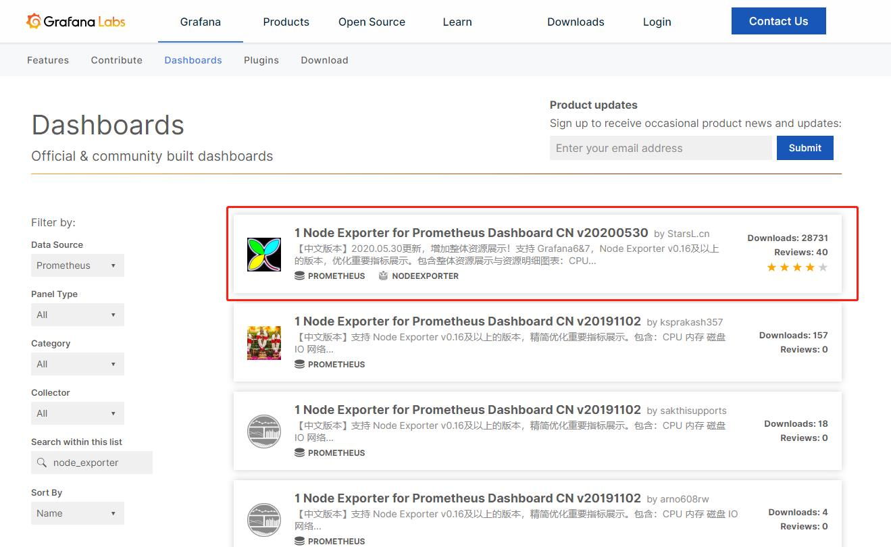

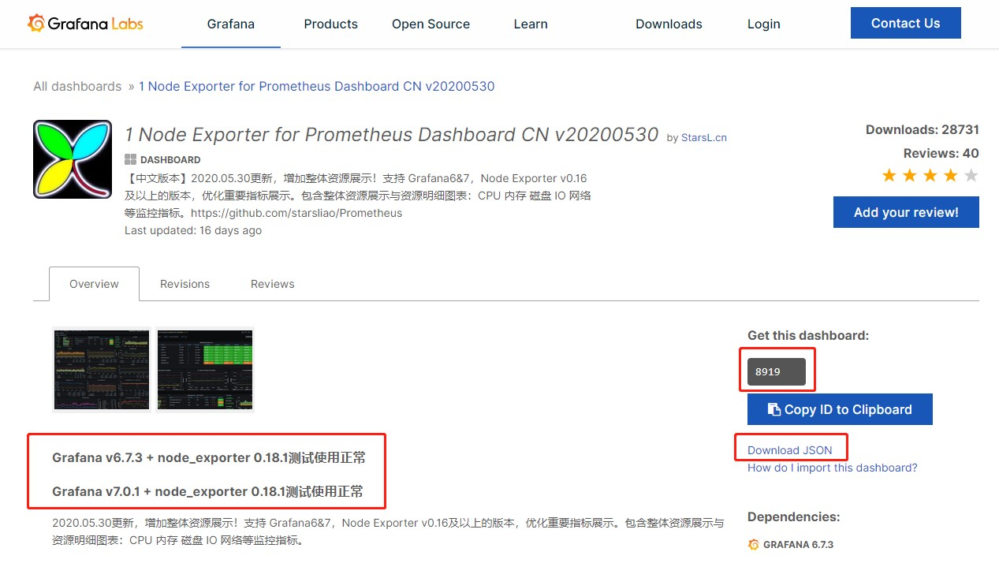

## 创建prometheus.yml配置文件

文件路径：/opt/prometheus/prometheus.yml

注意修改job_name对应的值，改成对应服务器的IP比较直观

```yml
# my global config
global:
  scrape_interval:     15s # Set the scrape interval to every 15 seconds. Default is every 1 minute.
  evaluation_interval: 15s # Evaluate rules every 15 seconds. The default is every 1 minute.
  # scrape_timeout is set to the global default (10s).

# Alertmanager configuration
alerting:
  alertmanagers:
  - static_configs:
    - targets:
      # - alertmanager:9093

# Load rules once and periodically evaluate them according to the global 'evaluation_interval'.
rule_files:
  # - "first_rules.yml"
  # - "second_rules.yml"

# A scrape configuration containing exactly one endpoint to scrape:
# Here it's Prometheus itself.
scrape_configs:
  # The job name is added as a label `job=<job_name>` to any timeseries scraped from this config.
  - job_name: '10.255.175.224'

    # metrics_path defaults to '/metrics'
    # scheme defaults to 'http'.

    static_configs:
    - targets: ['node-exporter:9100']
```

## docker部署

```shell
docker pull prom/prometheus:v2.19.0
docker pull prom/node-exporter:v0.18.1
docker pull grafana/grafana:7.0.1
docker network create prometheus-net
docker run -itd --network=prometheus-net --network-alias node-exporter --name node-exporter prom/node-exporter:v0.18.1
docker run -itd --network=prometheus-net --network-alias prometheus -p 9090:9090 -v /opt/prometheus/prometheus.yml:/etc/prometheus/prometheus.yml --name prometheus prom/prometheus:v2.19.0
docker run -itd --network=prometheus-net --network-alias grafana -p 3000:3000 --name grafana grafana/grafana:7.0.1
```

## 配置grafana

+ 打开浏览器，输入：服务器IP:3000，初始账号密码都为：admin，第一次登陆后需要会进入修改密码界面


+ 登陆成功

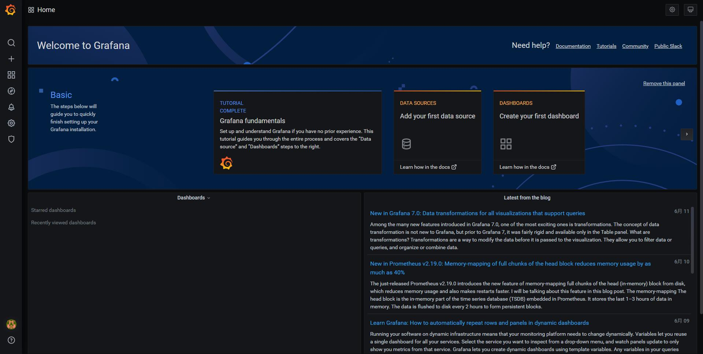

+ 配置Data Sources

点击左侧Configuration下的Data Sources

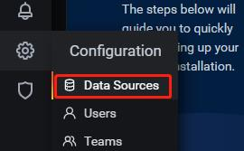

点击Add data source按钮


选择Prometheus

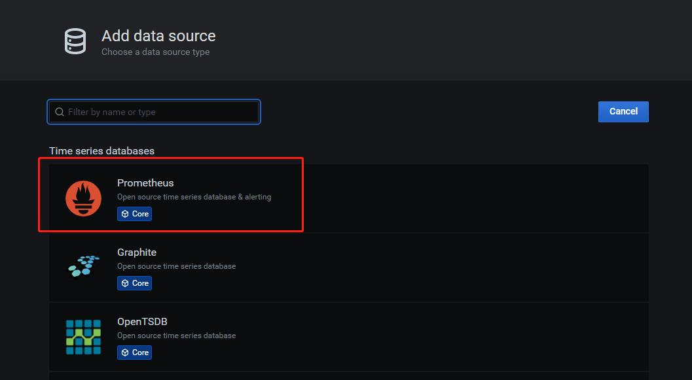

填写url


点击Save & Test按钮，出现Data source is working绿色提示，则代表成功

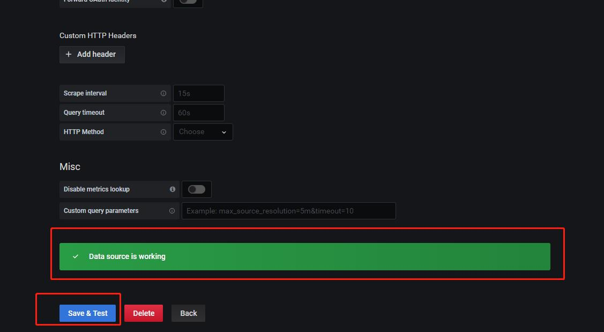

选择左侧Create下的Import

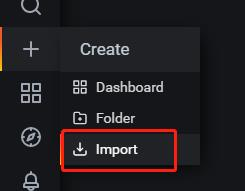

点击Upload .json file按钮

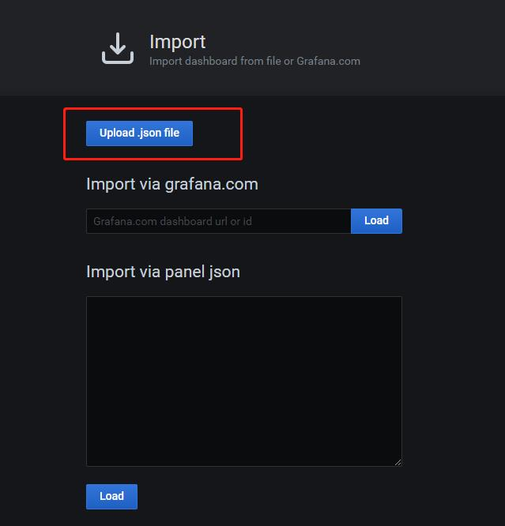

选择最开始下载的json文件，修改Name和Prometheus（刚才创建的Data Sources），点击Import按钮

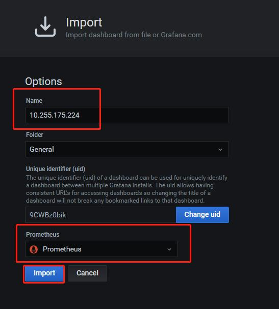

点击右上角的下拉小箭头

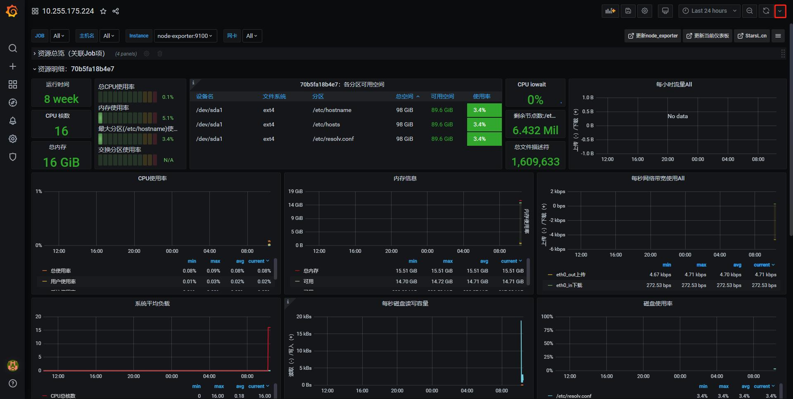

选择刷新数据时间

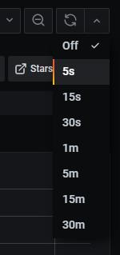

少部分数据可能需要等一段时间才能够获取，到这里已经部署完成了

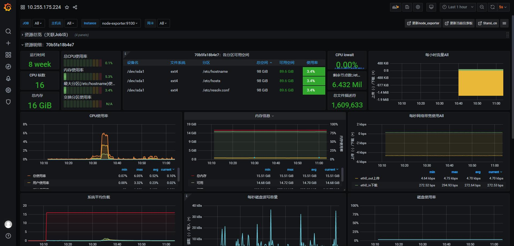
