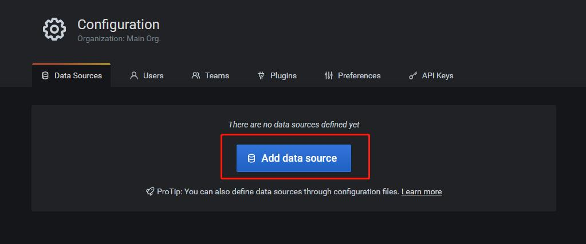
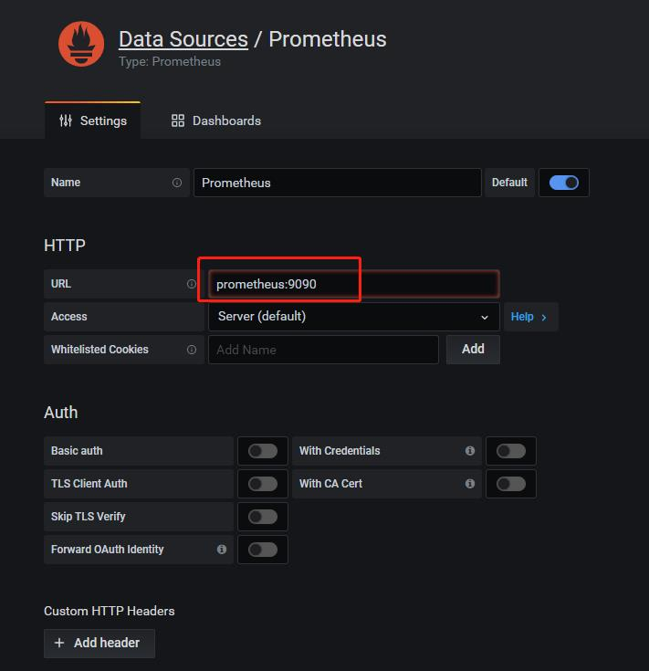
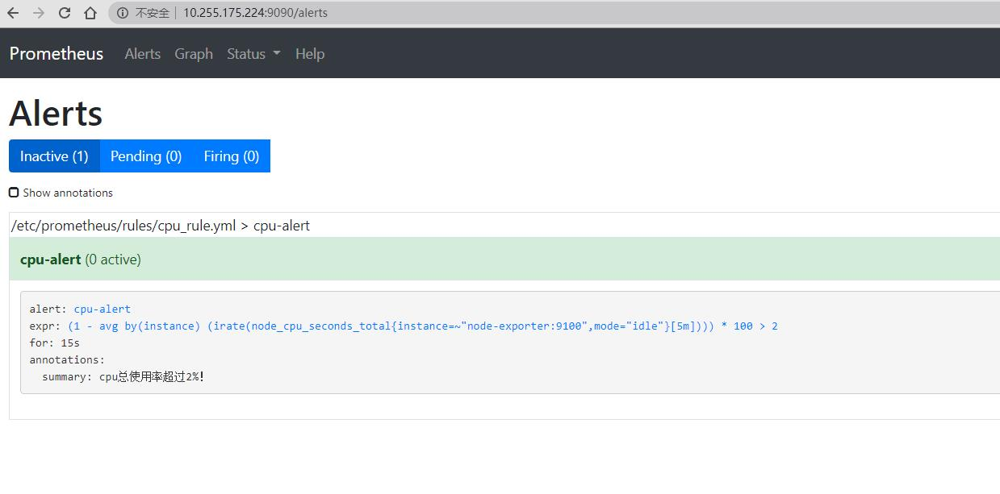
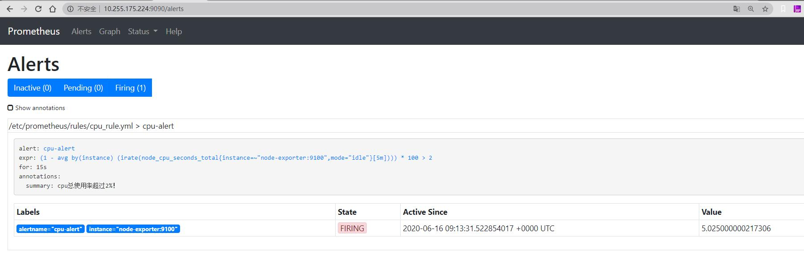
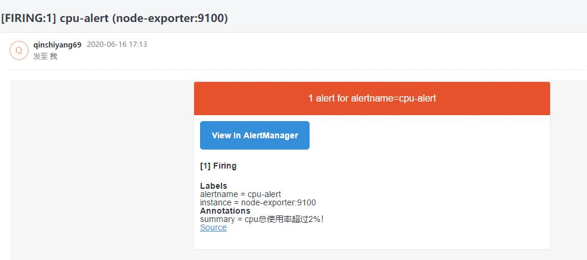
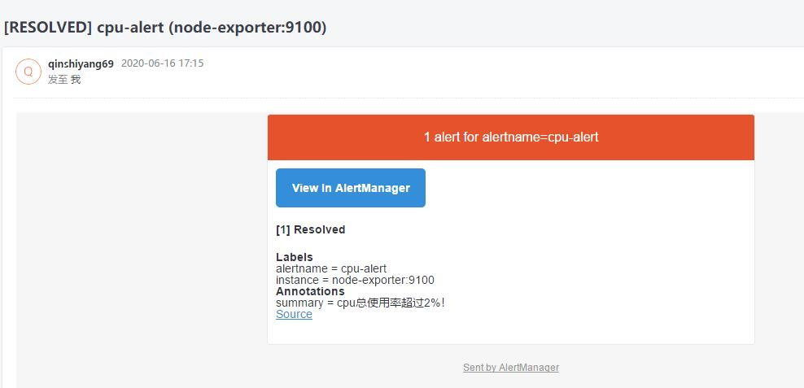

# Grafana+Prometheus监控服务器状态

## 确定适用的Grafana和node_exporter版本

打开[Grafana官网](https://grafana.com/grafana/dashboards?dataSource=prometheus&direction=asc&orderBy=name&search=node_exporter)，点击第一项Node Export...，确认Grafana和node_exporter版本并下载**json文件**


## 创建prometheus.yml配置文件

文件路径：/opt/prometheus/prometheus.yml

注意修改job_name对应的值，改成对应服务器的IP比较直观

```yml
# my global config
global:
  scrape_interval:     15s # Set the scrape interval to every 15 seconds. Default is every 1 minute.
  evaluation_interval: 15s # Evaluate rules every 15 seconds. The default is every 1 minute.
  # scrape_timeout is set to the global default (10s).

# Alertmanager configuration
alerting:
  alertmanagers:
  - static_configs:
    - targets:
      - alertmanager:9093

# Load rules once and periodically evaluate them according to the global 'evaluation_interval'.
rule_files:
  # - "first_rules.yml"
  # - "second_rules.yml"
  - "/etc/prometheus/rules/*.yml"

# A scrape configuration containing exactly one endpoint to scrape:
# Here it's Prometheus itself.
scrape_configs:
  # The job name is added as a label `job=<job_name>` to any timeseries scraped from this config.
  - job_name: '10.255.175.224'

    # metrics_path defaults to '/metrics'
    # scheme defaults to 'http'.

    static_configs:
    - targets: ['node-exporter:9100']
```

## 创建rules配置文件

文件路径：/opt/prometheus/rules/cpu_rule.yml

```yml
groups:
- name: cpu-alert
  rules:
  - alert: cpu-alert
    expr: (1 - avg(irate(node_cpu_seconds_total{instance=~"node-exporter:9100",mode="idle"}[5m])) by (instance))*100 > 2
    for: 15s
    annotations:
      summary: "cpu总使用率超过2%！"
```

## 创建alertmanager.yml配置文件

文件路径：/opt/prometheus/alertmanager.yml

注意修改smtp设置和接收告警邮箱地址

```yml
global:
  resolve_timeout: 5m
  smtp_from: '***69@163.com'
  smtp_smarthost: 'smtp.163.com:465'
  smtp_auth_username: '***69@163.com'
  smtp_auth_password: '******'
  smtp_require_tls: false
  smtp_hello: '163.com'
route:
  group_by: ['alertname']
  group_wait: 5s
  group_interval: 5s
  repeat_interval: 5m
  receiver: 'email'
receivers:
- name: 'email'
  email_configs:
  - to: '接收告警邮箱地址'
    send_resolved: true
inhibit_rules:
  - source_match:
      severity: 'critical'
    target_match:
      severity: 'warning'
    equal: ['alertname', 'dev', 'instance']
```

## docker部署

注意修改镜像版本

```shell
docker pull prom/prometheus:v2.19.0
docker pull prom/node-exporter:v0.18.1
docker pull grafana/grafana:7.0.1
docker pull prom/alertmanager:v0.20.0
docker network create prometheus-net
docker run -itd --network=prometheus-net --network-alias node-exporter -p 9100:9100 --name node-exporter prom/node-exporter:v0.18.1
docker run -itd --network=prometheus-net --network-alias prometheus -p 9090:9090 -v /opt/prometheus/prometheus.yml:/etc/prometheus/prometheus.yml -v /opt/prometheus/rules/:/etc/prometheus/rules/ --name prometheus prom/prometheus:v2.19.0
docker run -itd --network=prometheus-net --network-alias grafana -p 3000:3000 --name grafana grafana/grafana:7.0.1
docker run -itd --network=prometheus-net --network-alias alertmanager -p 9093:9093 -v /opt/prometheus/alertmanager.yml:/etc/alertmanager/alertmanager.yml --name alertmanager prom/alertmanager:v0.20.0
```

## 配置grafana

+ 打开浏览器，输入：服务器IP:3000，初始账号密码都为：admin，第一次登陆后需要会进入修改密码界面


+ 登陆成功


+ 配置Data Sources

点击左侧Configuration下的Data Sources


点击Add data source按钮



选择Prometheus


填写url



点击Save & Test按钮，出现Data source is working绿色提示，则代表成功


选择左侧Create下的Import


点击Upload .json file按钮


选择最开始下载的json文件，修改Name和Prometheus（刚才创建的Data Sources），点击Import按钮


点击右上角的下拉小箭头


选择刷新数据时间


少部分数据可能需要等一段时间才能够获取，到这里已经部署完成了


## 验证告警

告警规则可在Prometheus（服务器IP:9090）界面查看



在服务器随便运行一个服务，使cpu使用率超过2%，查看告警信息



查看告警邮件（邮件标题开头为[FIRING:1]）



关闭服务器服务，Prometheus告警状态恢复，查看状态恢复邮件（邮件标题开头为[RESOLVED]）



邮件内容是可配置的，具体配置方法暂未研究
