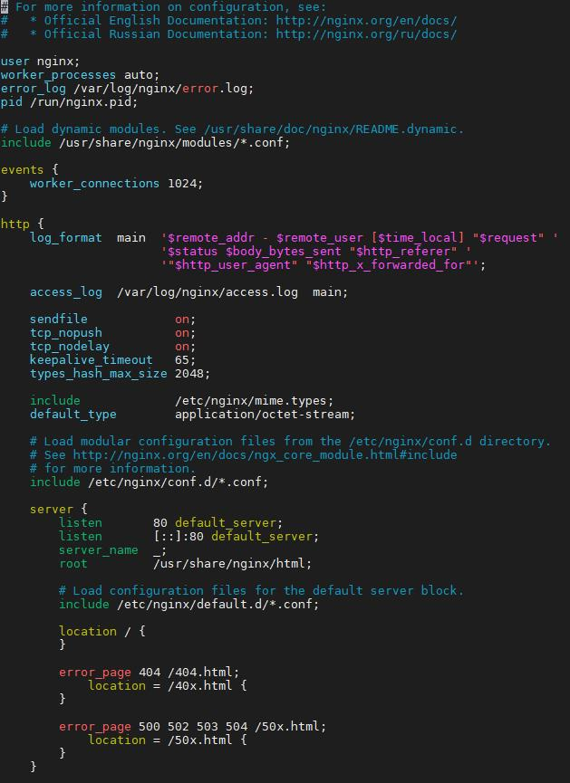

# Nginx

+ [使用yum安装](#使用yum安装)
+ [配置nginx](#配置nginx)
+ [常用命令](#常用命令)

Nginx是一款自由的、开源的、高性能的HTTP服务器和反向代理服务器

官方文档：http://nginx.org/en/docs/

___

## 使用yum安装

```shell
yum install -y nginx
```

## 配置nginx

配置文件地址：/etc/nginx/nginx.conf



配置文件解析(图片来源于网络)：


从图中我们可以看出配置文件主要包含以下几大部分内容:

1. main（全局设置）：设置的指令将影响其他所有设置
2. server（主机设置）：指令主要用于指定主机和端口
3. upstream（负载均衡服务器设置）：指令主要用于负载均衡，设置一系列的后端服务器
4. location（URL匹配特定位置的设置）：用于匹配网页位置。  

server继承main，location继承server，upstream既不会继承其他设置也不会被继承。

### 全局块

该部分配置主要影响Nginx全局，通常包括下面几个部分：

+ user：指定可以运行Nginx服务器的用户

    指令格式：user user [group]

    user：指定可以运行Nginx服务器的用户；group：可选项，可以运行Nginx服务器的用户组。

    如果user指令不配置或者配置为user nobody nobody，默认由nobody账户运行。

+ worker_processes: 制定了Nginx要开启的进程数

    指令格式：worker_processes number | auto  

    number : Nginx 进程最多可以产生的worker process 数。  

    auto ： Nginx 进程将自动检测  

+ error_log: 错误日志存放路径

    指定格式：error_log file stderr;  

    file : 日志输出到某个文件file  

    stderr : 日志输出到标准错误输出 （日志输出级别有debug，info，notice，
    warn，error，erit可供选择，其中，debug输出日志最为详细，而crit输出日志最少）。 

+ pid: Nginx进程PID存放路径

    Nginx进程是作为系统守护进程在进行，需要在某个文件中保存当前运行程序的主进程号，Nginx支持该保存文件路径的定义。  

    指令格式：pid file;  

    file：指定存放路径和文件名称。  

    如果不指定，则默认置于路径 logs/nginx.pid  

#### events块

events事件指令是设定Nginx的工作模式及连接数上限

+ work_connections：用于定义Nginx每个进程的最大连接数，默认是1024。

#### http块

+ log_format：自定义服务日志

+ sendfile：允许sendfile方式传输文件

    指令格式：sendfile  on

    这个指令中的参数on是表示开启高效文件传输模式，默认是关闭状态（off），将tcp_nopush和tcp_nodelay两个指令设置为on用于防止网络阻塞

+ keepalive_timeout：连接超时时间

    指令格式：keepalive_timeout number

    设置客户端连接保持活动的超时时间。在超过这个时间之后，服务器会关闭该连接；

+ 定义MIMI-Type

    指令格式:include file

    该指令主要用于将其他的Nginx配置或第三方模块的配置引用到当前的主配文件中，减少主配置文件的复杂度。default_type  application/octet-stream

    default_type：属于HTTP核心模块指令，这里设定默认类型为二进制流。也就是当文件类型未定义时使用这种方式

#### server块

server 块是对虚拟主机的配置，server标志定义虚拟主机开始，

+ listen用于指定虚拟主机的服务端口
+ server_name 用来指定IP地址或域名，多个域名之间用空格分开
+ index用于设定访问的默认首页地址
+ root指令用于指定虚拟主机的网页根目录，这个目录可以是相对路径，也可以是绝对路径
+ charset用于设置网页的默认编码格式
+ access_log 用来指定虚拟主机的访问日志存放路径，最后的main 用于指定访问日志的输出格式

示例：

```txt
http:

server {
        listen  443;
        server_name  test;

        ...
}

https:
server {
        listen  443 ssl;
        server_name  test;

        ...
}
```

#### location块

由于location配置过于灵活，所以这里不详细写，只写了个人使用的部分

```txt
location / {
    proxy_set_header Host $host;
    proxy_set_header X-Real-IP $remote_addr;
    proxy_set_header X-Forwarded-For $proxy_add_x_forwarded_for;
    proxy_pass http://localhost:9000/;
}
```

## 常用命令

```txt
  -?,-h         : this help
  -v            : show version and exit
  -V            : show version and configure options then exit
  -t            : test configuration and exit
  -T            : test configuration, dump it and exit
  -q            : suppress non-error messages during configuration testing
  -s signal     : send signal to a master process: stop, quit, reopen, reload
  -p prefix     : set prefix path
  -c filename   : set configuration file
  -g directives : set global directives out of configuration file

例：
启动：nginx -c /etc/nginx/nginx.conf

重新加载配置文件：nginx -s reload

退出：nginx -s quit
```
