# Prometheus服务器监控系统

功能：监控服务器各种状态，设置告警，当某项状态值出现异常时通过邮件进行告警

node-exporter：向prometheus提供服务器状态信息

prometheus：接收并存储服务器状态信息，设置告警

alertmanager：告警触发时向指定邮箱发送告警邮件

Grafana：调取prometheus信息，更直观的展示工具

## 文件结构

+ docker-compose.yml：docker compose文件
+ node-exporter.json：Grafana仪表盘json
+ config：配置文件
  + alertmanager.yml：alertmanager配置文件
  + prometheus.yml：prometheus配置文件
  + rules：告警规则
    + cpu_rule.yml：当cpu使用率超过2%时触发告警，发送告警邮件

## 部署

+ 修改prometheus.yml文件中的scrape_configs配置，改为服务器IP，端口不变

```yml
scrape_configs:
  # The job name is added as a label `job=<job_name>` to any timeseries scraped from this config.
  - job_name: '服务器IP'
  
    # metrics_path defaults to '/metrics'
    # scheme defaults to 'http'.
  
    static_configs:
    - targets: ['服务器IP:9100']
```

+ 修改alertmanager.yml文件中的smtp和接收邮件地址

```yml
global:
  resolve_timeout: 5m
  smtp_from: '******'
  smtp_smarthost: 'smtp.163.com:465'
  smtp_auth_username: '******'
  smtp_auth_password: '******'
  smtp_require_tls: false
  smtp_hello: '163.com'
route:
  group_by: ['alertname']
  group_wait: 5s
  group_interval: 5s
  repeat_interval: 5m
  receiver: 'email'
receivers:
  - name: 'email'
    email_configs:
    - to: '接收告警邮件地址'
      send_resolved: true
inhibit_rules:
  - source_match:
      severity: 'critical'
    target_match:
      severity: 'warning'
    equal: ['alertname', 'dev', 'instance']
```

+ 修改cpu_rule.yml文件中的expr字段中的instance值，改为和prometheus.yml中对应

```yml
groups:
  - name: CPU预警
    rules:
    - alert: CPU预警
      expr: (1 - avg(irate(node_cpu_seconds_total{instance=~"修改此处:9100",mode="idle"}[5m])) by (instance))*100 > 2
      for: 15s
      annotations:
        summary: "CPU总使用率超过2%！"

```

+ 将整个文件夹上传至服务器，执行构建命令（需先安装docker和docker compose）

```shell
docker-compose up -d
```

## 配置grafana

+ 打开浏览器，输入：服务器IP:3000，初始账号密码都为：admin，第一次登陆后需要会进入修改密码界面


+ 登陆成功

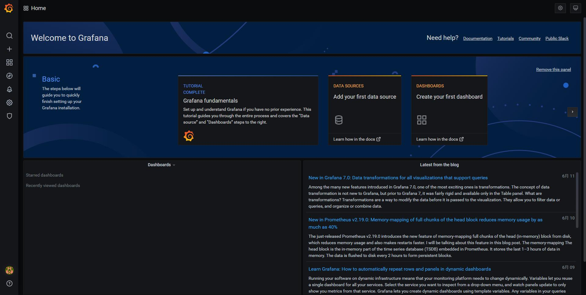

+ 配置Data Sources

点击左侧Configuration下的Data Sources

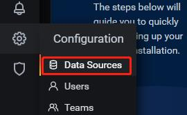

点击Add data source按钮

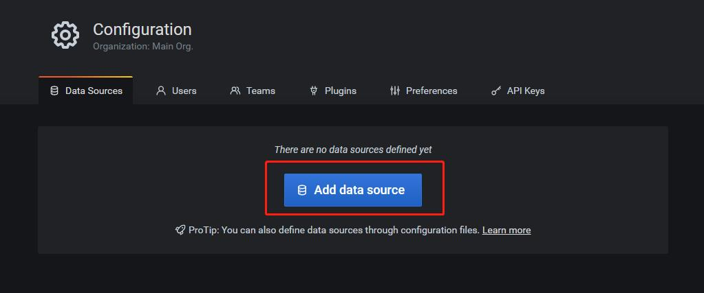

选择Prometheus

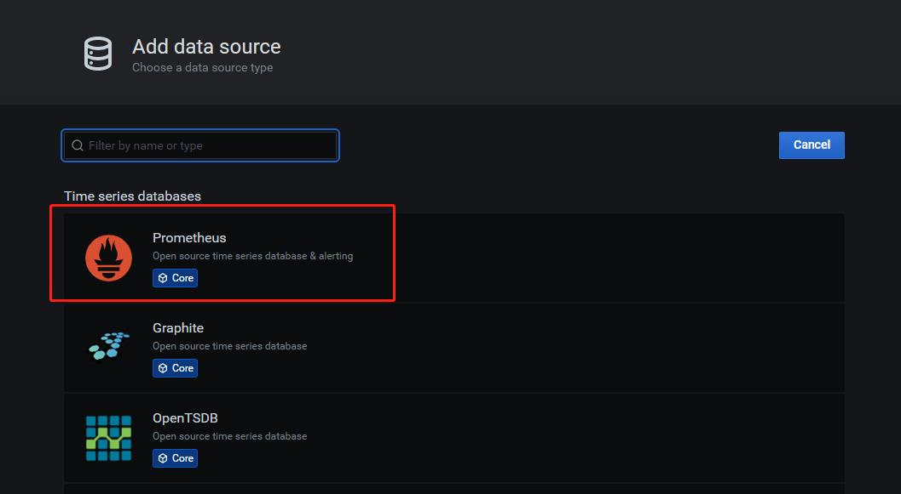

填写url

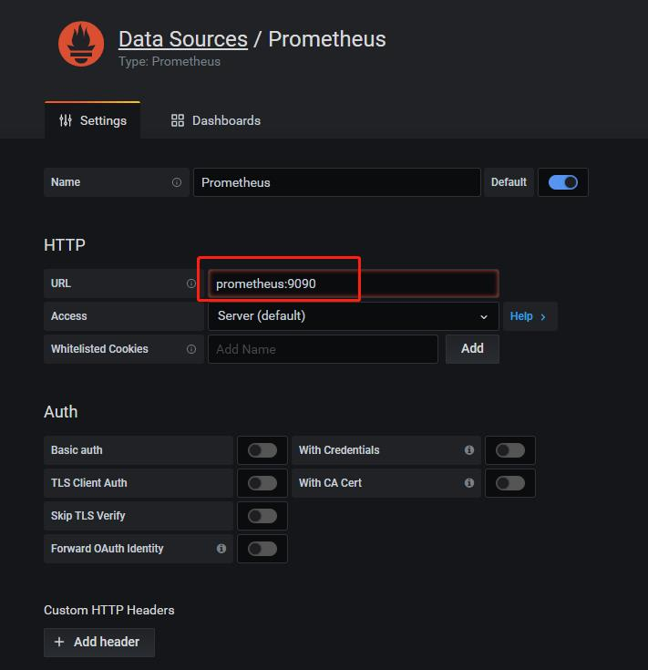

点击Save & Test按钮，出现Data source is working绿色提示，则代表成功

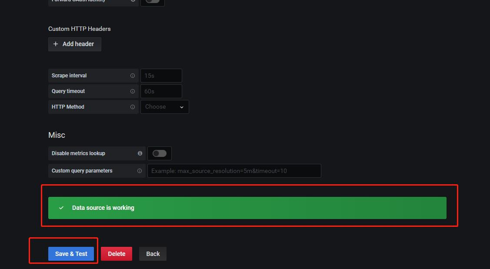

选择左侧Create下的Import

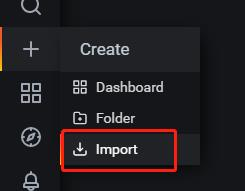

点击Upload .json file按钮

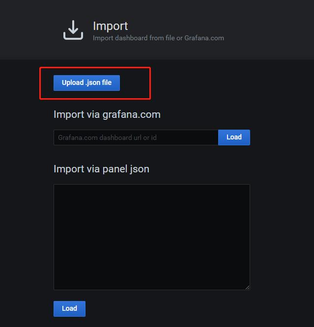

选择node-exporter.json文件，修改Name和Prometheus（刚才创建的Data Sources），点击Import按钮


点击右上角的下拉小箭头


选择刷新数据时间

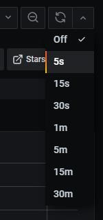

少部分数据可能需要等一段时间才能够获取，到这里已经部署完成了

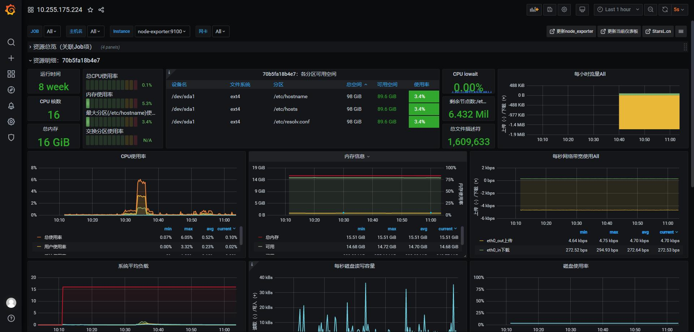

## 验证告警

告警规则可在Prometheus（服务器IP:9090）界面查看

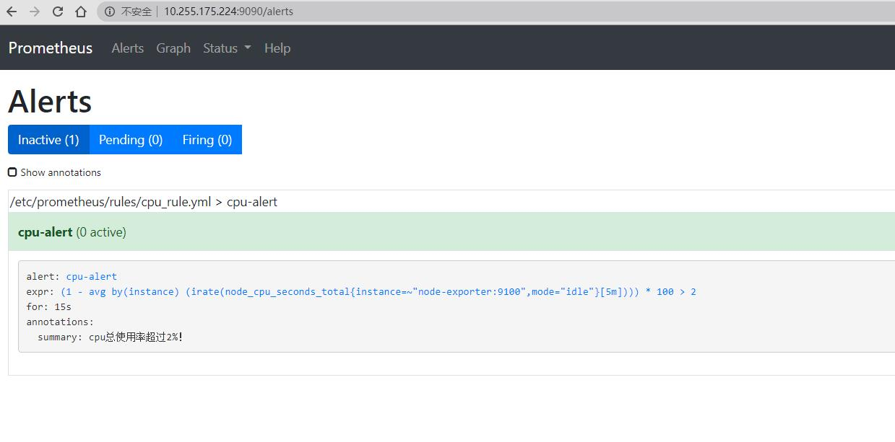

在服务器随便运行一个服务，使cpu使用率超过2%，查看告警信息

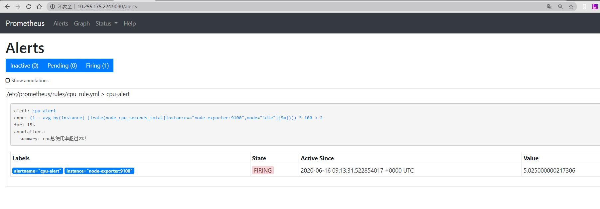

查看告警邮件（邮件标题开头为[FIRING:1]）

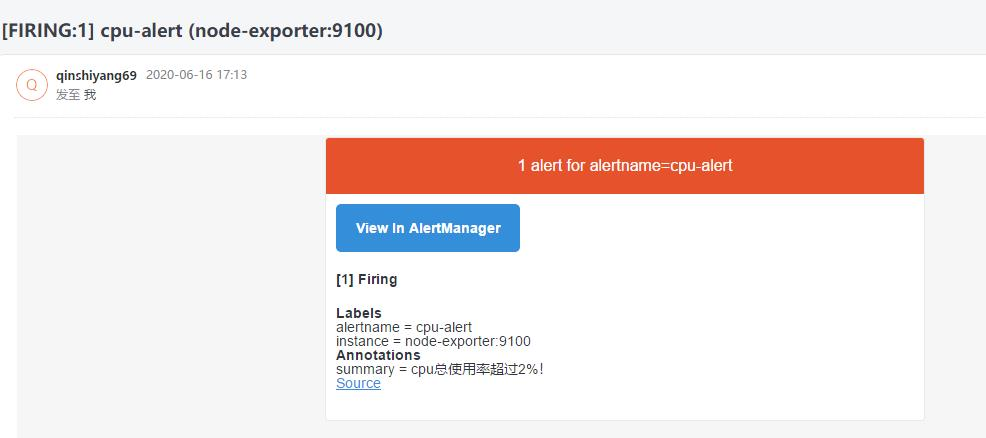

关闭服务器服务，Prometheus告警状态恢复，查看状态恢复邮件（邮件标题开头为[RESOLVED]）

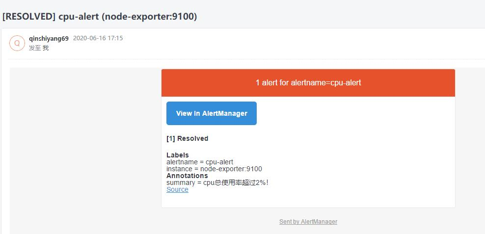

邮件内容是可配置的，具体配置方法暂未研究

## Prometheus数据查询接口

url: http://Prometheus服务器IP:9090/api/v1/query?query=查询语句

method: GET
