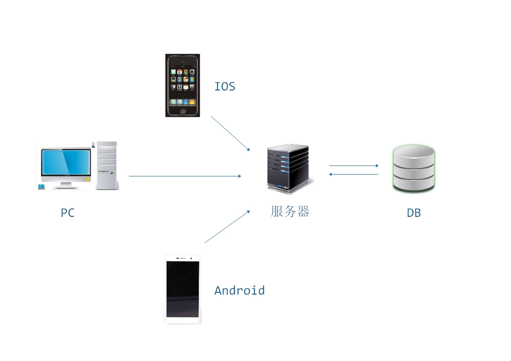

- [概述](##概述)
- [事务](##事务)
- [ORM数据库隔离层](##orm数据库隔离层)
- [REST服务与RestfulAPI风格](##rest服务与restfulapi风格)
- [路由](##路由)
- [AOP](##aop)
- [模板引擎](##模板引擎)
- [CORS跨域访问](##cors跨域访问)

## 概述

知识合集，比较杂，不定时更新

## 事务

简单来说就是一次完整的逻辑处理中，数据的修改不是全部成功记录就是全部失败回滚，中间还有一些与并发有关的事务隔离级别的问题

事务（Transaction）是由一系列对系统中数据进行访问与更新的操作所组成的一个程序执行逻辑单元。

+ ACID

    + 原子性（Atomicity）

        原子性是指事务必须是一个原子的操作序列单元。事务中包含的各项操作在一次执行过程中只允许出现两种状态：

        1. 全部执行成功
        2. 全部执行失败

        任何一项操作都会导致整个事务的失败，同时其他已经被执行的操作都被撤销并回滚，只有所有的操作全部成功，整个事务才算是成功完成

    + 一致性（Consistency） 

        一致性是指事务的执行不会破坏数据库数据的完整性和一致行，一个事务在执行之前和执行之后，数据库都必须处与一致性状态

        比如：A转账给B，不可能A账户扣钱，B账户没有加钱

    + 隔离性（Isolation）

        隔离性是指在并发环境中，并发的事务时相互隔离的，一个事务的执行不能被其他事务干扰，也就是说，在不同的事务并发操作相同数据时，每个事务都有各自完整的数据空间。

        一个事务内部的操作及使用的数据对其他并发事务的隔离的，并发执行的各个事务是不能相互干扰的

    + 持久性（Duration） 

        事务的持久性是指事务一旦提交后，数据库中的数据必须被永久的保存下来。即使服务器系统突然崩溃或者服务器宕机等故障。只要数据库重新启动，那么一定能够将其恢复到事务成功结束后的状态

+ 事务并发引起的问题

    + 脏读

        一个事务正在处理某一数据，并对其进行了更新，但同时尚未完成事务，因此还没有提交事务；而以此同时，允许另一个事务也能够访问该数据。

        脏读示例：  
        在事务A和事务B同时执行时可能会出现如下场景：

        时间|事务A（存款）|事务B（取款）
        -|-|-
        T1|开始事务|——
        T2|——|开始事务
        T3|——|查询余额（1000元）
        T4|——|取出1000元（余额0元）
        T5|查询余额（0元）|——
        T6|——|撤销事务（余额恢复1000元）
        T7|存入500元（余额500元|——
        T8|提交事务|——

    + 不可重复读

        多次读取可能会获得不同的数据

        不可重复度示例：

        时间|事务A（存款）|事务B（取款）
        -|-|-
        T1|开始事务|——
        T2|——|开始事务
        T3|——|查询余额（1000元）
        T4|查询余额（1000元）|——
        T5|——|取出1000元（余额0元）
        T6|——|提交事务
        T7|查询余额（0元）|——
        T8|提交事务|——

        事务A只进行了2次查询，结果钱从1000变成了0

    + 幻读

        指同样的事务操作，在前后两个时间段内执行对同一个数据项的读取，可能出现不一致的结果。

        幻读示例：

        时间|事务A（统计总存款）|事务B（存款）
        -|-|-
        T1|开始事务|——
        T2|——|开始事务
        T3|统计总存款（1000元）|——
        T4|——|存入100元
        T5|——|提交事务
        T6|提交总存款（10100）|——
        T7|提交事务|——

        在一个事务中多次统计总存款时看到结果不一样。

+ 事务隔离级别

    + 读未提交（READ_UNCOMMITTED）

        该隔离级别允许脏读取，隔离级别最低。

    + 读已提交（READ_COMMITTED）

        指不同执行的时候只能获取到已经提交的数据。  
        不会出现脏读，但解决不了可重复读问题

    + 可重复读（REPEATABLE_READ）

        可重复读就是保证在事务处理过程中，多次读取同一个数据时，该数据的值和事务开始时刻是一致的。因此该事务级别进制了不可重复读取和脏读，但是有可能出现幻读的数据。

    + 顺序读（SERIALIZABLE）

        顺序读是最严格的事务隔离级别。它要求所有的事务排队顺序执行，即事务只能一个接一个地处理，不能并发。

    事务隔离级别对比：

    事务隔离级别|脏读|不可重复读|幻读
    -|:-:|:-:|:-:
    读未提及（READ_UNCOMMITTED）|允许|允许|允许
    读已提交（READ_COMMITTED）|禁止|允许|允许
    可重复读（REPEATABLE_READ）|禁止|禁止|允许
    顺序读（SERIALIZABLE）|禁止|禁止|禁止

    4种事务隔离级别从上往下，级别越高，并发性越差，安全性就越来越高。
    一般数据默认级别是读以提交或可重复读。

## ORM数据库隔离层

简单来说就是将数据库中的表映射成后端代码中的对象，然后无需执行sql语句，直接通过对对象实体的操作来操作数据库。

面向对象编程和关系型数据库，都是目前最流行的技术，但是它们的模型是不一样的。面向对象编程把所有实体看成对象（object），关系型数据库则是采用实体之间的关系（relation）连接数据。对象关系映射（Object Relational Mapping，简称ORM）模式是一种为了解决面向对象与关系数据库存在的互不匹配的现象的技术。简单的说，ORM是通过使用描述对象和数据库之间映射的元数据，将程序中的对象自动持久化到关系数据库中。

ORM 把数据库映射成对象：
```
数据库的表（table） --> 类（class）
记录（record，行数据）--> 对象（object）
字段（field）--> 对象的属性（attribute）
```

sql操作：
```
sql = "SELECT id, first_name, last_name, phone, birth_date, sex FROM persons WHERE id = 10"
res = db.execSql(sql)
name = res[0]["first_name"]
```

改成 ORM 的写法如下:
```
p = Person.get(10)
name = p.first_name
```

总结起来，ORM 有下面这些优点:

+ 数据模型都在一个地方定义，更容易更新和维护，也利于重用代码。
+ ORM 有现成的工具，很多功能都可以自动完成，比如数据消毒、预处理、事务等等。
+ 它迫使你使用 MVC 架构，ORM 就是天然的 Model，最终使代码更清晰。
+ 基于 ORM 的业务代码比较简单，代码量少，语义性好，容易理解。
+ 你不必编写性能不佳的 SQL。

但是，ORM 也有很突出的缺点:

+ ORM 库不是轻量级工具，需要花很多精力学习和设置。
+ 对于复杂的查询，ORM 要么是无法表达，要么是性能不如原生的 SQL。
+ ORM 抽象掉了数据库层，开发者无法了解底层的数据库操作，也无法定制一些特殊的 SQL。

拓展：MVC(来自百度百科)

MVC 是一种使用 MVC（Model View Controller 模型-视图-控制器）设计创建 Web 应用程序的模式：

+ Model（模型）表示应用程序核心（比如数据库记录列表）。
+ View（视图）显示数据（数据库记录）。
+ Controller（控制器）处理输入（写入数据库记录）。

MVC 模式同时提供了对 HTML、CSS 和 JavaScript 的完全控制。

Model（模型）是应用程序中用于处理应用程序数据逻辑的部分。通常模型对象负责在数据库中存取数据。

View（视图）是应用程序中处理数据显示的部分。通常视图是依据模型数据创建的。

Controller（控制器）是应用程序中处理用户交互的部分。通常控制器负责从视图读取数据，控制用户输入，并向模型发送数据。

MVC 分层有助于管理复杂的应用程序，因为您可以在一个时间内专门关注一个方面。例如，您可以在不依赖业务逻辑的情况下专注于视图设计。同时也让应用程序的测试更加容易。  

MVC 分层同时也简化了分组开发。不同的开发人员可同时开发视图、控制器逻辑和业务逻辑。

## REST服务与RestfulAPI风格

+ 什么是REST

REST是REpresentation State Transfer的缩写，直接翻译：表现层状态转移，这个翻译不太好理解。一个比较通俗的说法是：URL定位资源，用HTTP动词（GET，POST，DELETE，PUSH等）描述操作。

+ 什么是Restful

基于REST构建的API就是Restful风格。

+ 为什么使用Restful

近年随着移动互联网的发展，各种类型的客户端层出不穷，Restful可以通过一套统一的接口为PC、微信(H5)、IOS和Android提供服务，这样的接口不需要前端样式，只提供数据。Restful架构如下：



+ 如何设计Restful风格的API

1. Resource资源，首先是弄清楚资源的概念。资源就是网络上的一个实体、一段文本、一张图片或者一首歌曲。资源总是要通过一种载体来反应它的内容。文本可以用TXT，也可以用HTML或者XML、图片可以用JPG格式或者PNG格式，JSON是现在最常用的资源表现形式。

2. 统一接口。Restful风格的数据元操作CRUD(create,read,update,delete)分别对应HTTP方法：GET用来获取资源，POST用来新建资源(也可以用于更新资源)，PUT用来更新资源，DELETE用来删除资源，这样就统一了数据操作的接口。

3. HTTP状态码，在REST中都有特定的意义：200，201，202，204，400，401，403，500。比如401表示用户身份认证失败，403表示你验证身份通过了，但这个资源你不能操作。

4. 无状态。所谓无状态即所有的资源都可以URI定位，而且这个定位与其他资源无关，也不会因为其他资源的变化而变化。

Restful是典型的基于HTTP的协议，HTTP连接最显著的特点是客户端发送的每次请求都需要服务器回送响应，在请求结束后，会主动释放连接。从建立连接到关闭连接的过程称为“一次连接”。前面一次请求与后面一次请求没有必然的联系，所以是无状态的。

拓展：TCP/IP要建立一个连接，需要经过三次握手，可以简单的理解为：
1. 客户端发起连接请求，等待服务器响应 
2. 服务器接收到请求，确认客户端发起的包，并多返回一个包
3. 客户端接收服务器发过来的包，并且回复给服务器确认包，至此三次握手完成，连接建立

握手过程中传送的包里不包含数据，三次握手完毕后，客户端与服务器才正式开始传送数据。理想状态下，TCP连接一旦建立，在通信双方中的任何一方主动关闭连接之前，TCP 连接都将被一直保持下去。所以TCP/IP是有状态的。

## 路由


## aop


## 模板引擎


## cors跨域访问