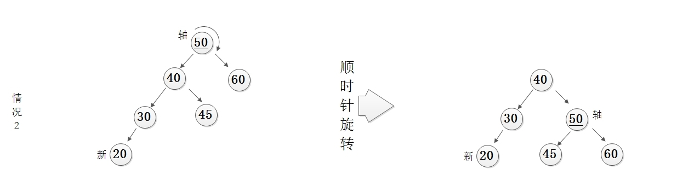
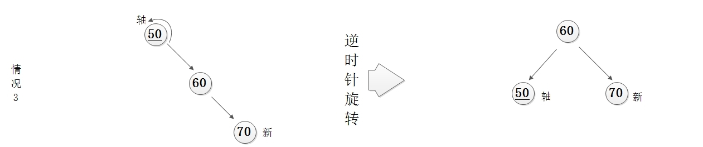
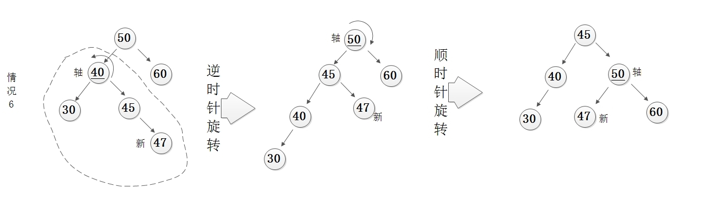

# 树 ADT

对于大量的输入数据，链表的线性访问时间太慢，不宜使用。因此引入树。

定义树的一种自然的方式是递归的方法。一棵树是一些节点的集合。这个集合可以是空集；若非空，则一棵树由称作根的节点r以及0个或多个非空的子树T1,T2,...,Tk组成，这些子树中每一颗的根都被自根r的一条有向的边所连接。

每一颗子树的根叫做根r的儿子，而r是每一颗子树的根的父亲。

**树叶**：没有儿子的节点  
**兄弟**：具有相同父亲的节点（类似的可以定义祖父和孙子的关系）  
**路径**：从节点n1到nk的路径定义为节点n1,n2,...nk的一个序列，使得对于1<=i<k，节点ni是ni+1的父亲。这个路径的长为该路径上的边的条数。从每一个节点到它自己有一条长为0的路径。在一棵树中从根到每个节点恰好存在一条路径。  
**节点的深度**：从根到节点的唯一路径的长  
**节点的高**：从节点到一片树叶的最长路径的长  
**树的深度**：最深树叶的深度  
**树的高**：从根到一片树叶的最长路径的长，空树的高度定义为-1  

+ 树的遍历：

    1. 先序遍历：根节点->左子树->右子树
    2. 中序遍历：左子树->根节点->右子树
    3. 后续遍历：左子树->右子树->根节点

## 二叉树

二叉树是每个节点都不能由多于两个儿子的树

## 二叉搜索树

使二叉树成为二叉查找树的性质是：对于树中的每个节点X，它的左子树中所有关键字值小于X的关键字值，而它的右子树中所有关键字值大于X的关键字值

## 平衡二叉树（AVL树）

平衡二叉树是满足每个结点的左右子树高度（亦称深度）之差在[0，1，-1]这个范围内的二叉搜索树

当AVL特性被破坏时，我们可以进行简单的修正来恢复，我们称其为旋转(LL、RR、LR、RL旋转)

LL旋转：

RR旋转：

RL旋转：

LR旋转：

