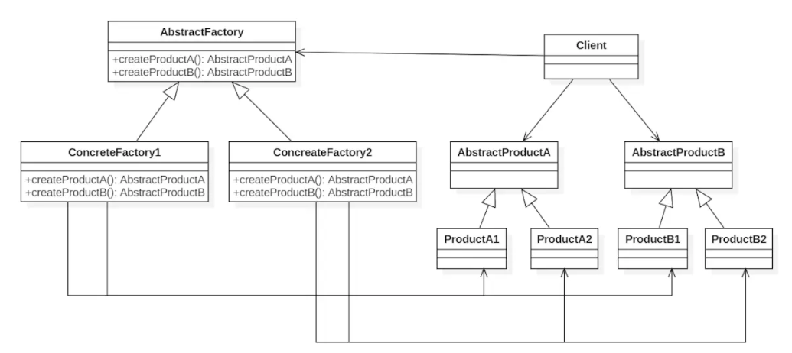

### Abstract Factory(抽象工厂)——对象创建型模式

+ 定义：

抽象工厂模式提供了一个创建一系列相关或者相互依赖对象的接口，无需指定它们具体的类。

构建简单或复杂对象，以单一步骤或单一方式构建对象，构建过程固定，强调系列产品。

+ 适用场景

1. 客户端（应用层）不依赖于产品类实例如何被创建、实现等细节
2. 强调一系列相关的产品对象（属于同一产品族）一起使用创建对象需要大量的重复代码
3. 提供一个产品类的库，所有的产品以同样的接口出现，从而使得客户端不依赖于具体的实现

+ 优点

1. 具体产品在应用层的代码隔离，无需关心创建的细节
2. 将一个系列的产品统一到一起创建

+ 缺点

1. 规定了所有可能被创建的产品集合，产品簇中扩展新的产品困难；
2. 增加了系统的抽象性和理解难度

+ 结构：

+ 实例

产品A：手机  
产品B：路由器  

手机A：小米手机  
手机B：华为手机

路由器A：小米路由器  
路由器B：华为路由器

[github链接](https://github.com/shiyangqin/Qinsy/tree/master/design_patterns/Abstract_Factory_Pattern)
