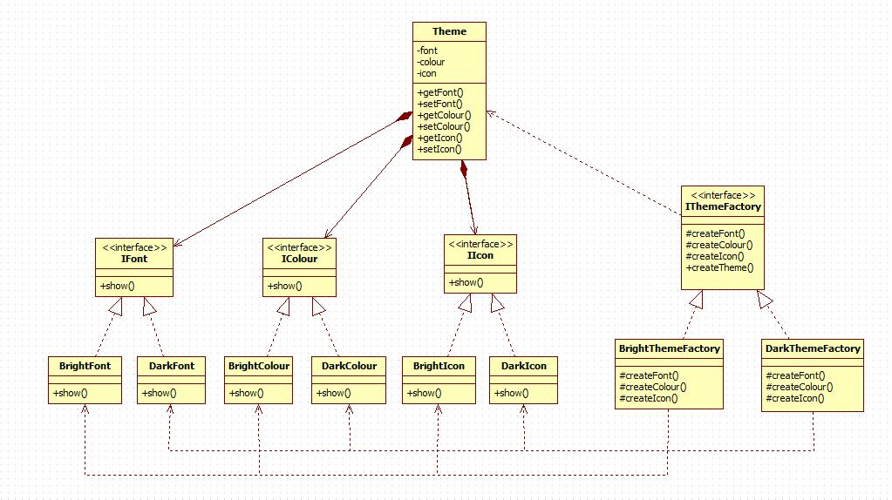

# Abstract Factory Pattern

提供一个接口以创建一系列相关或相互依赖的对象，而无须指定它们具体的类。

## 优点

1. 当一个产品族中的多个对象被设计成一起工作时，它能保证客户端始终只使用同一个产品族中的对象。

## 缺点

1. 产品族扩展非常困难，要增加一个系列的某一产品，既要在抽象的 Creator 里加代码，又要在具体的里面加代码。

## 使用场景

一个产品包含一系列子产品时，例如修改主题，一个主题包括颜色、字体、图标等等，

## 注意事项

产品族难扩展，产品等级易扩展。

### [实现](https://github.com/shiyangqin/Qinsy/tree/master/DesignPatterns/AbstractFactoryPattern)

