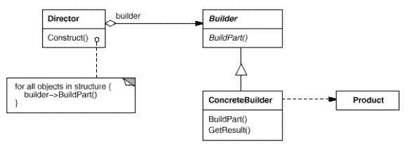

### Builder(生成器)——对象创建型模式

+ 意图：

将一个复杂对象的构建与它的表示分离，使得同样的构建构成可以构建不同的表示。

构建复杂对象，以多个步骤或多种方式构建对象，对创建过程中每一个步骤的精细控制以及步骤间次序的控制，专注一个特定产品

+ 适用场景

1. 当创建复杂对象的算法应该独立于该对象的组成部分以及它们的装配方式时
2. 当构造过程必须允许被构造的对象有不同的表示时

+ 优点

1. 将一个对象分解为各个组件
2. 将对象组件的构造封装起来
3. 可以控制整个对象的生成过程

+ 缺点

1. 对不同类型的对象需要实现不同的具体构造器的类，这可能会大大增加类的数量

+ 结构：

+ 实例

同样是电脑，不同的厂家生产会有不同的配置，生产流程也可能不同

[github链接](https://github.com/shiyangqin/Qinsy/tree/master/design_patterns/Builder_Pattern)
