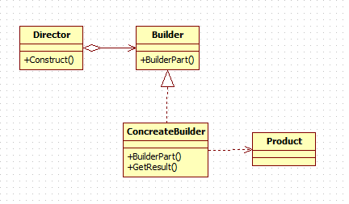
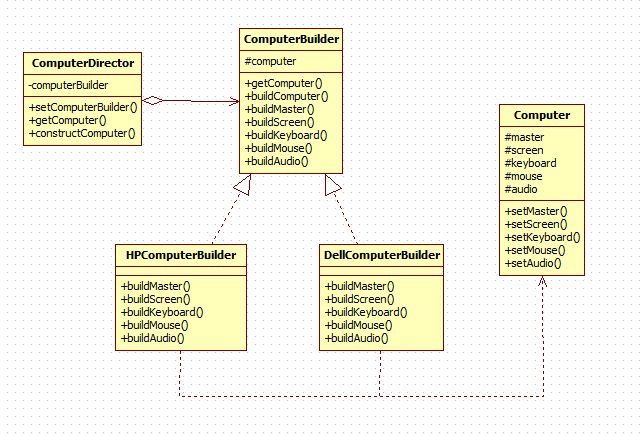

# Builder(生成器)——对象创建型模式

## 定义

将一个复杂对象的构建与它的表示分离，使得同样的构建构成可以构建不同的表示。

## 主要作用

在用户不知道对象的建造过程和细节的情况下就可以直接创建复杂的对象。

用户只需要给出指定复杂对象的类型和内容；

建造者模式负责按顺序创建复杂对象（把内部的建造过程和细节隐藏起来)

## 适用场景

1. 当创建复杂对象的算法应该独立于该对象的组成部分以及它们的装配方式时
2. 当构造过程必须允许被构造的对象有不同的表示时

## UML类图：

## [实例](https://github.com/shiyangqin/Qinsy/tree/master/design_patterns/Builder_Pattern)

