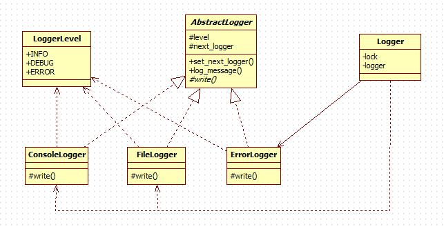

# Chain of Responsibility Pattern

责任链模式为请求创建了一个接收者对象的链。这种模式给予请求的类型，对请求的发送者和接收者进行解耦。在这种模式中，通常每个接收者都包含对另一个接收者的引用。如果一个对象不能处理该请求，那么它会把相同的请求传给下一个接收者，依此类推。

## 意图

使多个对象都有机会处理请求，从而避免请求的发送者和接收者之间的耦合关系。将这些对象连成一条链，并沿着这条链传递该请求，直到有一个对象处理它为止。

## 优点

1. 降低耦合度。它将请求的发送者和接收者解耦。
2. 简化了对象。使得对象不需要知道链的结构。
3. 增强给对象指派职责的灵活性。通过改变链内的成员或者调动它们的次序，允许动态地新增或者删除责任。
4. 增加新的请求处理类很方便。

## 缺点

1. 不能保证请求一定被接收。
2. 系统性能将受到一定影响，而且在进行代码调试时不太方便，可能会造成循环调用。
3. 可能不容易观察运行时的特征，有碍于除错。

## 使用场景

1. 有多个对象可以处理同一个请求，具体哪个对象处理该请求由运行时刻自动确定。
2. 在不明确指定接收者的情况下，向多个对象中的一个提交一个请求。
3. 可处理一个请求的对象集合应被动态指定。

## [实现](https://github.com/shiyangqin/Qinsy/tree/master/design_patterns/chain_of_responsibility_pattern)

 