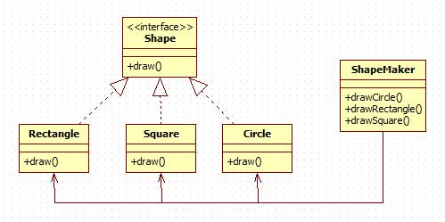

# Facade Pattern

外观模式隐藏系统的复杂性，并向客户端提供了一个客户端可以访问系统的接口。

## 意图

为子系统中的一组接口提供一个一致的界面，外观模式定义了一个高层接口，这个接口使得这一子系统更加容易使用

## 优点

1. 减少系统相互依赖。
2. 提高灵活性。
3. 提高了安全性。

## 缺点

不符合开闭原则，如果要改东西很麻烦，继承重写都不合适。

## 使用场景

1. 为复杂的模块或子系统提供外界访问的模块。
2. 子系统相对独立。
3. 预防低水平人员带来的风险。

## 注意事项

在层次化结构中，可以使用外观模式定义系统中每一层的入口。

## [实现](https://github.com/shiyangqin/Qinsy/tree/master/design_patterns/facade_pattern)

