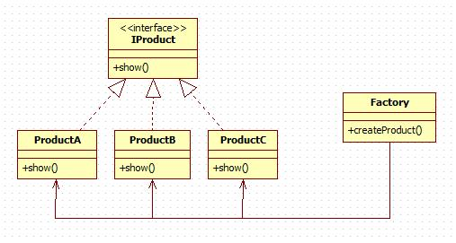
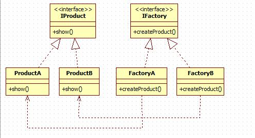

# Factory Pattern

通常我们所说的工厂模式是指工厂方法模式，还有一种简单实用的模式是简单工厂模式，又叫静态工厂方法（Static Factory Method）模式

在工厂模式中，我们在创建对象时不会对客户端暴露创建逻辑，并且是通过使用一个共同的接口来指向新创建的对象。

## 使用场景

在任何需要生成复杂对象的地方，都可以使用工厂模式

## 注意事项

作为一种创建类模式，在任何需要生成复杂对象的地方，都可以使用工厂方法模式。有一点需要注意的地方就是复杂对象适合使用工厂模式，而简单对象，特别是只需要通过 new 就可以完成创建的对象，无需使用工厂模式。如果使用工厂模式，就需要引入一个工厂类，会增加系统的复杂度。

## 简单工厂

## 意图

简单工厂模式定义一个工厂类来负责创建产品类的实例，被创建的实例通常都具有共同的父类。在简单工厂模式中，可以根据参数的不同返回不同产品类的实例。

### 优点

1. 一个调用者想创建一个对象，只要知道其名称就可以了。
2. 屏蔽产品的具体实现，调用者只关心产品的接口。
3. 把初始化实例时的工作放到工厂里进行，使代码更容易维护。

### 缺点

1. 由于工厂类集中了所有产品创建逻辑，一旦不能正常工作，整个系统都要受到影响。
2. 违背“开放 - 关闭原则”，一旦添加新产品就不得不修改工厂类的逻辑，这样就会造成工厂逻辑过于复杂。
3. 无法形成基于继承的等级结构

### [实现](https://github.com/shiyangqin/Qinsy/tree/master/DesignPatterns/SimpleFactoryPattern)

 
## 工厂方法

### 意图

定义一个用于创建对象的接口，让子类决定实例化哪一个类

### 优点

1. 更符合开-闭原则。新增一种产品时，只需要增加相应的具体产品类和相应的工厂子类即可。
2. 符合单一职责原则。每个具体工厂类只负责创建对应的产品。
3. 不使用静态工厂方法，可以形成基于继承的等级结构。

### 缺点

1. 添加新产品时，除了增加新产品类外，还要提供与之对应的具体工厂类，系统类的个数将成对增加，在一定程度上增加了系统的复杂度；同时，有更多的类需要编译和运行，会给系统带来一些额外的开销。
2. 由于考虑到系统的可扩展性，需要引入抽象层，在客户端代码中均使用抽象层进行定义，增加了系统的抽象性和理解难度。
3. 虽然保证了工厂方法内的对修改关闭，但对于使用工厂方法的类，如果要更换另外一种产品，仍然需要修改实例化的具体工厂类。
4. 一个具体工厂只能创建一种具体产品

### [实现](https://github.com/shiyangqin/Qinsy/tree/master/DesignPatterns/FactoryMethodPattern)

