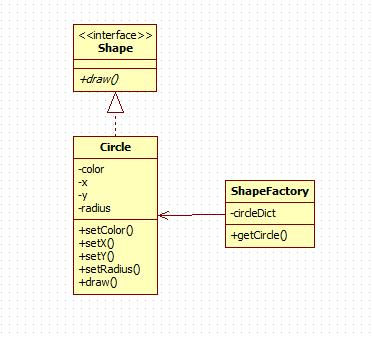

# Flyweight Pattern

享元模式主要用于减少创建对象的数量，以减少内存占用和提高性能。

## 意图

运用共享技术有效地支持大量细粒度地对象

## 优点

大大减少对象的创建，降低系统的内存，使效率提高。

## 缺点

提高了系统的负责度，需要分离出外部状态和内部状态，而且外部状态具有固有化的性质，不应该随着内部状态的变化而变化，否则会造成系统的混乱。

## 使用场景

1. 系统有大量相似对象。
2. 需要缓冲池的场景。

## 注意事项

1. 注意划分外部状态和内部状态，否则可能会引起线程安全问题。
2. 这些类必须有一个工厂对象加以控制。

## [实现](https://github.com/shiyangqin/Qinsy/tree/master/design_patterns/flyweight_pattern)

