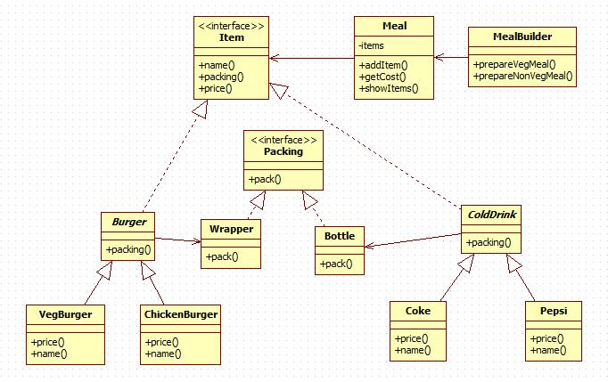

# Prototype Pattern

这种模式是实现了一个原型接口，该接口用于创建当前对象的克隆。当直接创建对象的代价比较大时，则采用这种模式。例如，一个对象需要在一个高代价的数据库操作之后被创建。我们可以缓存该对象，在下一个请求时返回它的克隆，在需要的时候更新数据库，以此来减少数据库调用。

## 意图

将一个复杂的构建与其表示相分离，使得同样的构建过程可以创建不同的表示。

## 优点

1. 建造者独立，易扩展。 
2. 便于控制细节风险。

## 缺点

1. 产品必须有共同点，范围有限制。
2. 如内部变化复杂，会有很多的建造类。

## 使用场景

1. 当创建复杂对象的算法独立于该对象的组成部分以及它们的装配方式时。
2. 当构造过程必须允许被构造的对象有不同的表示时。

## 注意事项

与工厂模式的区别是：建造者模式更加关注与零件装配的顺序。

### [实现](https://github.com/shiyangqin/Qinsy/tree/master/DesignPatterns/BuilderPattern)

