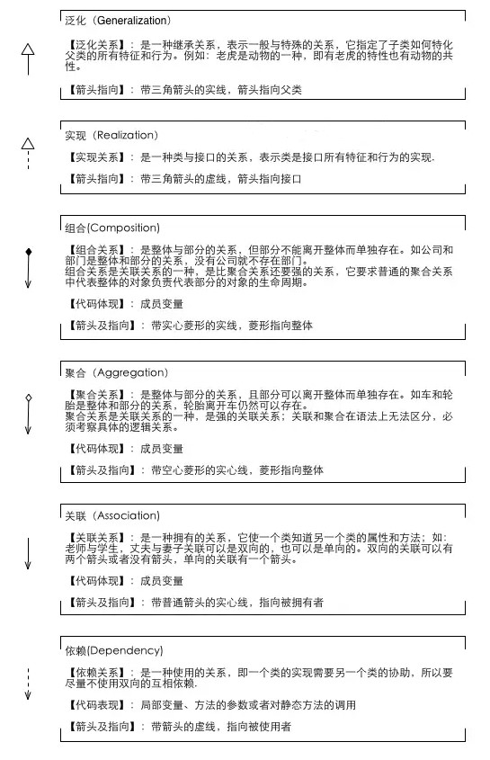
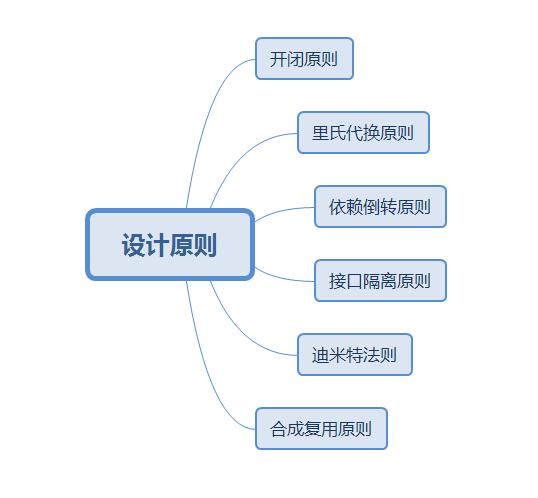
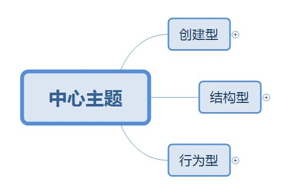
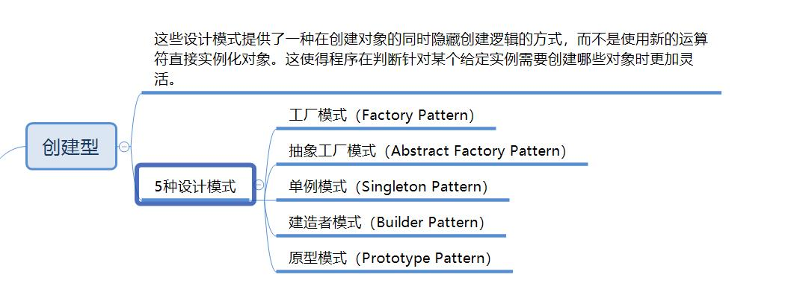
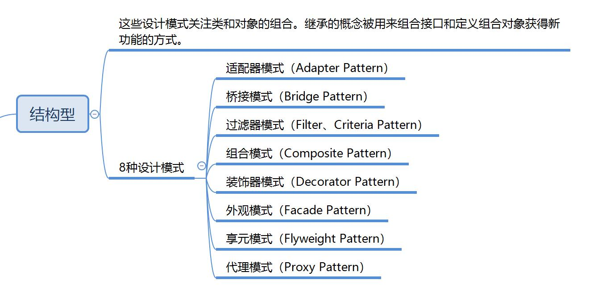
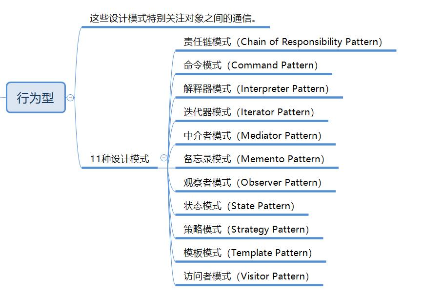

# 设计模式

文档主要参考了[w3c-设计模式](https://www.w3cschool.cn/shejimoshi/)和《设计模式-可复用面向对象软件的基础》

## 类关系

## 定义

设计模式是软件开发人员在软件开发过程中面临的一般问题的解决方案。这些解决方案是众多软件开发人员经过相当长的一段时间的试验和错误总结出来的。

设计模式是一套被反复使用的、多数人知晓的、经过分类编目的、代码设计经验的总结。使用设计模式是为了重用代码、让代码更容易被他人理解、保证代码可靠性。

## 设计模式的设计原则

+ 开闭原则（Open Close Principle）

开闭原则的意思是：对扩展开放，对修改关闭。在程序需要进行拓展的时候，不能去修改原有的代码，实现一个热插拔的效果。简言之，是为了使程序的扩展性好，易于维护和升级。想要达到这样的效果，我们需要使用接口和抽象类，后面的具体设计中我们会提到这点。

+ 里氏代换原则（Liskov Substitution Principle）

里氏代换原则是面向对象设计的基本原则之一。 里氏代换原则中说，任何基类可以出现的地方，子类一定可以出现。LSP 是继承复用的基石，只有当派生类可以替换掉基类，且软件单位的功能不受到影响时，基类才能真正被复用，而派生类也能够在基类的基础上增加新的行为。里氏代换原则是对开闭原则的补充。实现开闭原则的关键步骤就是抽象化，而基类与子类的继承关系就是抽象化的具体实现，所以里氏代换原则是对实现抽象化的具体步骤的规范。

+ 依赖倒转原则（Dependence Inversion Principle）

这个原则是开闭原则的基础，具体内容：针对对接口编程，依赖于抽象而不依赖于具体。

+ 接口隔离原则（Interface Segregation Principle）

这个原则的意思是：使用多个隔离的接口，比使用单个接口要好。它还有另外一个意思是：降低类之间的耦合度。由此可见，其实设计模式就是从大型软件架构出发、便于升级和维护的软件设计思想，它强调降低依赖，降低耦合。

+ 迪米特法则，又称最少知道原则（Demeter Principle）

最少知道原则是指：一个实体应当尽量少地与其他实体之间发生相互作用，使得系统功能模块相对独立。

+ 合成复用原则（Composite Reuse Principle）

合成复用原则是指：尽量使用合成/聚合的方式，而不是使用继承。

## 设计模式的分类

## 创建型

+ [Factory Pattern](FactoryPattern.md)

+ [Abstract Factory Pattern](AbstractFactoryPattern.md)

+ [Singleton Pattern](SingletonPattern.md)

+ [Builder Pattern](BuilderPattern.md)

+ [Prototype Pattern](PrototypePattern.md)

## 结构型

+ [Adapter Pattern](AdapterPattern.md)

+ [Bridge Pattern](BridgePattern.md)

+ [Composite Pattern](CompositePattern.md)

+ [Decorator Pattern](DecoratorPattern.md)

+ [Facade Pattern](FacadePattern.md)

+ [Flyweight Pattern](FlyweightPattern.md)

+ [Proxy Pattern](ProxyPattern.md)

## 行为型

+ [Chain of Responsibility Pattern](ChainOfResponsibilityPattern.md)

+ [Command Pattern](CommandPattern.md)

+ [Interpreter Pattern](InterpreterPattern.md)

+ [Iterator Pattern](IteratorPattern.md)

+ [Mediator Pattern](MediatorPattern.md)

+ [Memento Pattern](MementoPattern.md)

+ [Observer Pattern](ObserverPattern.md)

+ [State Pattern](StatePattern.md)

+ [Null Object Pattern](NullObjectPattern.md)

+ [Strategy Pattern](StrategyPattern.md)

+ [Template Pattern](TemplatePattern.md)

+ [Visitor Pattern](VisitorPattern.md)
