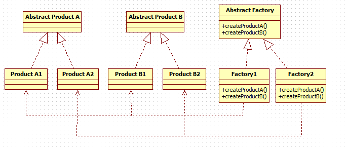
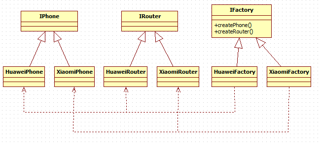

# Simple Factory(简单工厂))——对象创建型模式(不属于23种设计模式)

## 定义：

抽象工厂模式提供了一个创建一系列相关或者相互依赖对象的接口，无需指定它们具体的类。具体的工厂负责实现具体的产品实例。

## 主要作用

允许使用抽象的接口来创建一组相关产品，而不需要知道或关心实际生产出的具体产品是什么，这样就可以从具体产品中被解耦。

## 适用场景

1. 客户端（应用层）不依赖于产品类实例如何被创建、实现等细节
2. 强调一系列相关的产品对象（属于同一产品族）一起使用创建对象需要大量的重复代码
3. 提供一个产品类的库，所有的产品以同样的接口出现，从而使得客户端不依赖于具体的实现

## UML类图：

## [实例](https://github.com/shiyangqin/Qinsy/tree/master/design_patterns/Abstract_Factory_Pattern)

