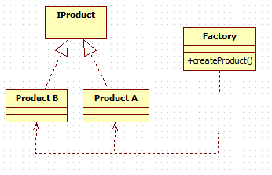

# Simple Factory(简单工厂))——对象创建型模式(不属于23种设计模式)

## 定义：

 简单工厂模式属于创建型模式又叫做静态工厂方法模式，在简单工厂模式中，可以根据参数的不同返回不同类的实例。

## 主要作用

将类实例化的操作与使用对象的操作分开，让使用者不用知道具体参数就可以实例化出所需要的产品类，从而避免了在客户端代码中显式指定，实现了解耦。

## 适用场景

1. 工厂类负责创建的对象比较少；
2. 客户只知道传入工厂类的参数，对于如何创建对象（逻辑）不关心；

## UML类图：

## [实例](https://github.com/shiyangqin/Qinsy/tree/master/design_patterns/Abstract_Factory_Pattern)

