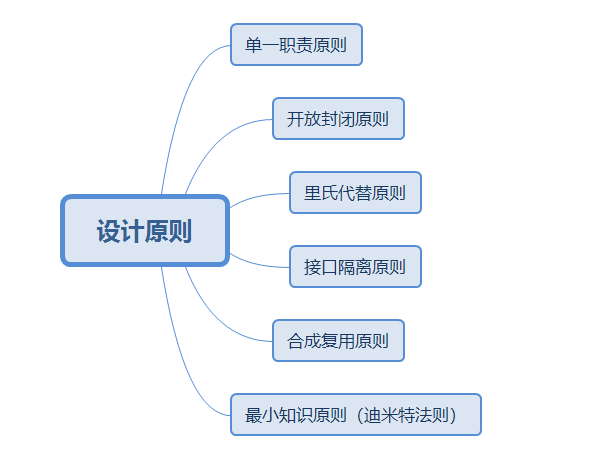
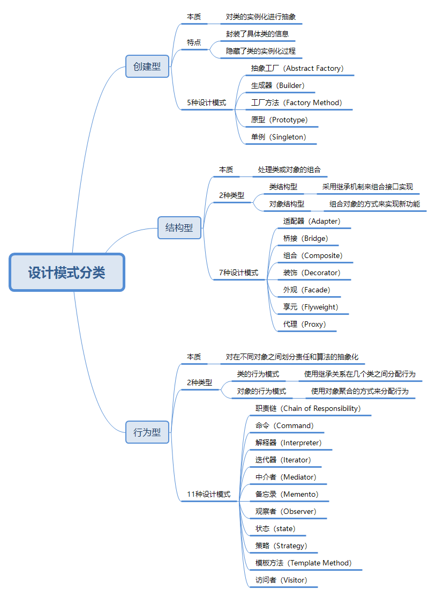

# 设计模式

## 定义

+ 某类特定问题的代码设计解决方案
+ 是一套代码设计的经验总结

设计模式只是前人的代码设计经验

## 作用

+ 提高代码复用率，降低开发成本和周期
+ 提高代码可维护性、可拓展性
+ 使代码更加优雅
+ 让代码更容易被他人理解

## 设计模式的设计原则

+ 单一职责原则

一个类只负责一个功能领域中的相应职责，或者可以定义为：就一个类而言，应该只有一个引起它变化的原因

如果一个类承担的职责过多，即耦合性太高=一个职责的变化可能会影响到其他的职责

+ 开放封闭原则

一个实体（类、函数、模块等）应该对外扩展开放，对内修改关闭

即每次发生变化时，要通过添加新的代码来增强现有类型的行为，而不是修改原有的代码。

符合开放封闭原则的最好方式是提供一个固有的接口，然后让所有可能发生变化的类实现该接口，让固定的接口与相关对象进行交互。

+ 里氏代替原则

所有引用基类的地方必须能透明地使用其子类的对象

在软件开发过程中，子类替换父类后，程序的行为是一样的。

只有当子类替换掉父类后软件的功能不受影响时，父类才能真正地被复用，而子类也可以在父类的基础上添加新的行为。

+ 依赖倒置原则

细节应该依赖于抽象，而抽象不应该依赖于细节。（针对接口编程，而不是针对实现编程）

所谓的的 “面向接口编程，而不是面向实现编程”。这样可以降低客户与具体实现的耦合。

+ 接口隔离原则

使用多个专门功能的接口，而不是使用单一的总接口。

不要让一个单一的接口承担过多的职责，而应把每个职责分离到多个专门的接口中，进行接口分离。

+ 合成复用原则

在一个新的对象里面使用一些已有的对象，使之成为新对象的一部分。

新对象通过向这些对象的委派达到复用已用功能的目的。简单地说，就是要尽量使用合成/聚合，尽量不要使用继承。

+ 最少知识原则（迪米特法则）

一个模块或对象应尽量少的与其他实体之间发生相互作用，使得系统功能模块相对独立，这样当一个模块修改时，影响的模块就会越少，扩展起来更加容易。

关于迪米特法则的其他描述：只与你直接的朋友们通信；不要跟“陌生人”说话。

外观模式（Facade Pattern)和中介者模式（Mediator Pattern）就使用了迪米特法则。

## 设计模式的分类

+ [Simple Factory(简单工厂))——对象创建型模式(不属于23种设计模式)](SimpleFactory.md)

+ [Abstract Factory(抽象工厂)——对象创建型模式](AbstractFactory.md)

+ [Builder(生成器)——对象创建型模式](Builder.md)

+ [Factory Method(工厂方法))——对象创建型模式](FactoryMethod.md)

+ [Prototype(原型))——对象创建型模式](Prototype.md)

+ [Singleton(单件))——对象创建型模式](Singleton.md)