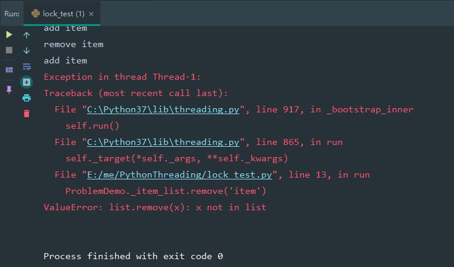

# Python锁

## GIL(global interpreter lock) -- 全局解释器锁

python 的解释器，有很多种，但市场占有率99.9%的都是基于c语言编写的CPython.  在这个解释器里规定了GIL

GIL使无论有多少个cpu，python在执行时在同一时刻只允许一个线程运行。（一个进程可以开多个线程，但线程只能同时运行一个）

## Lock

```python
# -*- coding:utf-8 -*-
import threading


class ProblemDemo(object):
    """问题样例"""
    _item_list = ['item']

    @staticmethod
    def run():
        for i in range(100):
            threading.Thread(target=ProblemDemo.__process).start()

    @staticmethod
    def __process():
        for _ in range(10):
            print('remove item')
            ProblemDemo._item_list.remove('item')
            print('add item')
            ProblemDemo._item_list.append('item')


if __name__ == '__main__':
    ProblemDemo.run()

```

代码执行报错步骤：

1. 初始ProblemDemo._item_list = ['item']
2. 线程1：ProblemDemo._item_list.remove('item')
3. cpu暂停执行线程1，开始执行线程2代码
4. 线程2：ProblemDemo._item_list.remove('item')
5. 当线程2执行remove时，_item_list中已经没有 item 了，抛出 ValueError: list.remove(x): x not in list



解决方法：给代码块加锁

```python
# -*- coding:utf-8 -*-
import threading


class LockDemo(object):
    """加锁样例"""
    _item_list = ['item']
    _item_list_lock = threading.Lock()

    @staticmethod
    def run():
        for i in range(100):
            threading.Thread(target=LockDemo.__process).start()

    @staticmethod
    def __process():
        for _ in range(10):
            with LockDemo._item_list_lock:
                print('remove item')
                LockDemo._item_list.remove('item')
                print('add item')
                LockDemo._item_list.append('item')


if __name__ == '__main__':
    LockDemo.run()

```

代码执行步骤：

1. 线程1获取锁，失去cpu
2. 线程2尝试获取锁，失败，线程阻塞
3. 线程1执行移除和添加操作，代码块执行完毕，释放锁
4. 线程2尝试获取锁，成功，线程2继续执行

## RLock

## Condition

## Semaphore和BoundedSemaphore

## Event

## Barrier
