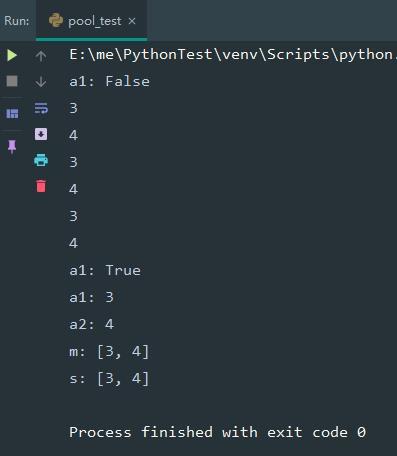
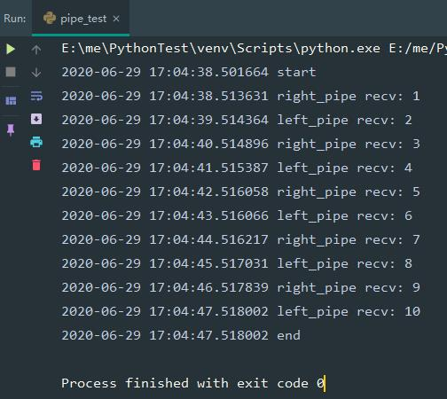

# multiprocessing模块

由于multiprocessing模块和threading模块有部分内容非常相似，先学习threading模块能够更快更好的学习multiprocessing模块

+ [Process](#Process)
+ [Pool](#Pool)
+ [Pipe](#Pipe)
+ [Queue](#Queue)
+ [Value](#Value)
+ [Array](#Array)
+ [Manager](#Manager)
+ 同步(以下类从multiprocessing模块导入，使用方法参考[threading模块](threading模块.md))
  + Lock
  + RLock
  + Condition
  + Event
  + Semaphore
  + BoundedSemaphore
  + Barrier

## Process

进程对象，Process和Thread的使用方法十分相似

创建进程的消耗比创建线程大

### 函数创建多线程

```python
# -*- coding:utf-8 -*-
import multiprocessing
import time


def run(t_name, sleep_time):
    print(t_name + " run")
    time.sleep(sleep_time)


def process_demo_1():
    """进程创建示例1"""
    for i in range(5):
        p = multiprocessing.Process(name="Process-"+str(i), target=run, args=("Process-"+str(i), i))
        print(p.name + " start")
        p.start()


if __name__ == '__main__':
    process_demo_1()

```

与Thread一样，可call的类对象同样可以使用

```python
# -*- coding:utf-8 -*-
import multiprocessing
import time


class CallDemo(object):

    def __init__(self, t_name, sleep_time):
        self._t_name = t_name
        self._sleep_time = sleep_time

    def __call__(self):
        self.run()

    def run(self):
        print(self._t_name + " run")
        time.sleep(self._sleep_time)


def process_demo_3():
    """进程创建示例3"""
    for i in range(5):
        p = multiprocessing.Process(name="Process-"+str(i), target=CallDemo("Process-"+str(i), i))
        print(p.name + " start")
        p.start()


if __name__ == '__main__':
    process_demo_3()

```

### 类创建多线程

```python
# -*- coding:utf-8 -*-
import multiprocessing
import time


class ProcessDemo2(multiprocessing.Process):
    """Process子类"""

    def run(self) -> None:
        print(self.name + " run")
        time.sleep(self._args[0])


def process_demo_2():
    """进程创建示例2"""
    for i in range(5):
        p = ProcessDemo2(name="Process-"+str(i), args=(i,))
        print(p.name + " start")
        p.start()


if __name__ == '__main__':
    process_demo_2()

```

### 守护进程

守护进程和守护线程的概念一样，当主进程结束时，会强制结束守护进程

```python
# -*- coding:utf-8 -*-
import multiprocessing
import time


class DaemonDemo(multiprocessing.Process):
    """守护进程样例"""

    def run(self) -> None:
        print(self.name + " run")
        time.sleep(self._args[0])
        print(self.name + " end")


def daemon_demo():
    """守护进程样例"""
    p = DaemonDemo(name="Process-daemon", args=(2,), daemon=True)
    print(p.name + " start")
    p.start()
    time.sleep(1)


if __name__ == '__main__':
    daemon_demo()

```

这里让主进程睡了1秒，因为如果不睡的话，守护进程第一条"Process-daemon run"信息都来不及打印就结束了，1秒后主进程结束，守护进程随之结束，第二条end信息打印不出

## Pool

进程池，默认大小是cup核数或1，优先cpu核数

```python
# -*- coding:utf-8 -*-
import multiprocessing
import os


def run(i):
    print(i+2)
    return i+2


def pool_demo():
    pool = multiprocessing.Pool(os.cpu_count() or 3)
    a1 = pool.apply_async(run, (1,))
    a2 = pool.apply_async(run, (2,))
    m = pool.map_async(run, [1, 2])
    s = pool.starmap_async(run, [(1,), (2,)])
    print("a1:", a1.ready())
    pool.close()
    pool.join()
    print("a1:", a1.successful())
    print("a1:", a1.get())
    print("a2:", a2.get())
    print("m:", m.get())
    print("s:", s.get())


if __name__ == '__main__':
    pool_demo()

```



带有_async的函数会直接返回一个结果对象，不带_async的apply、map和starmap会阻塞到函数结束

## Pipe

在两个进程间传递消息，Pipe()返回2个connection.Connection对象，

```python
# -*- coding:utf-8 -*-
import multiprocessing
import time
import datetime


def left_process(left_pipe):
    """左通道进程"""
    print(datetime.datetime.now(), "start")
    left_pipe.send(1)
    while True:
        value = left_pipe.recv()
        print(datetime.datetime.now(), "left_pipe recv:", value)
        if 10 <= value:
            left_pipe.send('exit')
            left_pipe.close()
            break
        time.sleep(1)
        left_pipe.send(value + 1)


def right_process(right_pipe):
    """右通道进程"""
    while True:
        value = right_pipe.recv()
        if value == 'exit':
            right_pipe.close()
            print(datetime.datetime.now(), "end")
            break
        print(datetime.datetime.now(), "right_pipe recv:", value)
        time.sleep(1)
        right_pipe.send(value + 1)


def pipe_demo():
    left_pipe, right_pipe = multiprocessing.Pipe()
    multiprocessing.Process(target=left_process, args=(left_pipe,)).start()
    multiprocessing.Process(target=right_process, args=(right_pipe,)).start()


if __name__ == '__main__':
    pipe_demo()

```



## Queue

除了 task_done() 和 join() 之外，Queue  实现了标准库类 queue.Queue 中所有的方法。

JoinableQueue 类是 Queue 的子类，额外添加了 task_done() 和 join() 方法。


## Value

## Array

## Manager
