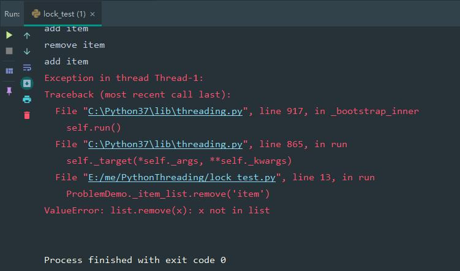
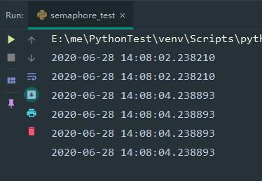
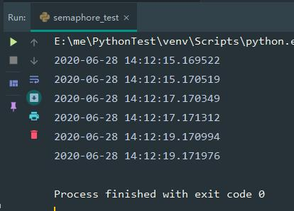

# threading模块

+ [Lock](#Lock)
+ [RLock](#RLock)
+ [Condition](#Condition)
+ [Semaphore和BoundedSemaphore](#Semaphore和BoundedSemaphore)
+ [Event](#Event)
+ [Barrier](#Barrier)
+ [Thread](#Thread)
+ [Timer](#Timer)

## Lock

当多个线程操作同一资源时，保证前一个线程操作完成，下一个才可以开始操作

```python
# -*- coding:utf-8 -*-
import threading


class ProblemDemo(object):
    """问题样例"""

    def __init__(self):
        self._item_list = ['item']

    def run(self):
        for i in range(100):
            threading.Thread(target=self.__process).start()

    def __process(self):
        for _ in range(10):
            print('remove item')
            self._item_list.remove('item')
            print('add item')
            self._item_list.append('item')


if __name__ == '__main__':
    ProblemDemo().run()

```

代码执行报错步骤：

1. 初始ProblemDemo._item_list = ['item']
2. 线程1：ProblemDemo._item_list.remove('item')
3. cpu暂停执行线程1，开始执行线程2代码
4. 线程2：ProblemDemo._item_list.remove('item')
5. 当线程2执行remove时，_item_list中已经没有 item 了，抛出 ValueError: list.remove(x): x not in list



解决方法：给代码块加锁

```python
# -*- coding:utf-8 -*-
import threading


class LockDemo(object):
    """加锁样例"""

    def __init__(self):
        self._item_list = ['item']
        self._item_list_lock = threading.Lock()

    def run(self):
        for i in range(100):
            threading.Thread(target=self.__process).start()

    def __process(self):
        for _ in range(10):
            with self._item_list_lock:
                print('remove item')
                self._item_list.remove('item')
                print('add item')
                self._item_list.append('item')


if __name__ == '__main__':
    LockDemo().run()

```

代码执行步骤：

1. 线程1获取锁，失去cpu
2. 线程2尝试获取锁，失败，线程阻塞
3. 线程1执行移除和添加操作，代码块执行完毕，释放锁
4. 线程2尝试获取锁，成功，线程2继续执行

## RLock

当获取一个资源需要先获取另一个资源时，保证一个线程获取其中一个资源的锁时，其他线程无法获取另外的锁，直到当前线程释放所有锁

```python
# -*- coding:utf-8 -*-
import threading


class ProblemDemo(object):
    """死锁样例"""

    def __init__(self):
        self._item_1 = 0
        self._item_2 = 0
        self._item_1_lock = threading.Lock()
        self._item_2_lock = threading.Lock()

    def run(self):
        threading.Thread(target=self.__process_1).start()
        threading.Thread(target=self.__process_2).start()

    def __process_1(self):
        for _ in range(10):
            with self._item_1_lock:
                print("item_1 + 1")
                self._item_1 += 1
                with self._item_2_lock:
                    print("item_2 + 1")
                    self._item_2 += 1

    def __process_2(self):
        for _ in range(10):
            with self._item_2_lock:
                print("item_2 + 1")
                self._item_2 += 1
                with self._item_1_lock:
                    print("item_1 + 1")
                    self._item_1 += 1


if __name__ == '__main__':
    ProblemDemo().run()

```

死锁步骤：

1. 线程1拿到_item_1_lock，失去cpu
2. 线程2拿到_item_2_lock，执行代码，尝试获取_item_1_lock
3. 线程1执行代码，尝试获取_item_2_lock
4. 2个线程各拿一个锁，互相等对方释放锁，达成死锁，代码执行停滞

```python
# -*- coding:utf-8 -*-
import threading


class RLockDemo(object):
    """递归锁样例"""

    def __init__(self):
        self._item_1 = 0
        self._item_2 = 0
        self._item_1_lock = self._item_2_lock = threading.RLock()

    def run(self):
        threading.Thread(target=self.__process_1).start()
        threading.Thread(target=self.__process_2).start()

    def __process_1(self):
        for _ in range(10):
            with self._item_1_lock:
                print("item_1 + 1")
                self._item_1 += 1
                with self._item_2_lock:
                    print("item_2 + 1")
                    self._item_2 += 1

    def __process_2(self):
        for _ in range(10):
            with self._item_2_lock:
                print("item_2 + 1")
                self._item_2 += 1
                with self._item_1_lock:
                    print("item_1 + 1")
                    self._item_1 += 1


if __name__ == '__main__':
    RLockDemo().run()

```

## Condition

条件变量，一个操作需要满足一个条件才能执行，python中的Queue是一个很好的例子，可以看一看

```python
# -*- coding:utf-8 -*-
import threading
from collections import deque


class ConditionDemo(object):
    """信号样例(参考Queue)"""

    def __init__(self, maxsize=0):
        """初始化队列"""
        self.maxsize = maxsize
        self._queue = deque()
        self.mutex = threading.Lock()
        self.not_empty = threading.Condition(self.mutex)
        self.not_full = threading.Condition(self.mutex)

    def size(self):
        """队列大小"""
        return len(self._queue)

    def is_full(self):
        """队列是否已满"""
        with self.mutex:
            return 0 < self.maxsize <= self.size()

    def is_empty(self):
        """队列是否已空"""
        with self.mutex:
            return not self.size()

    def put(self, item):
        """向队列中添加元素，队列满时阻塞，调用get函数时唤醒"""
        print("put item")
        with self.not_full:
            if self.maxsize > 0:
                while self.size() >= self.maxsize:
                    print("put item wait")
                    self.not_full.wait()
            self._queue.append(item)
            self.not_empty.notify()

    def get(self):
        """从队列中获取元素，队列空时阻塞，调用put函数时唤醒"""
        print("get item")
        with self.not_empty:
            while not self.size():
                print("get item wait")
                self.not_empty.wait()
            item = self._queue.popleft()
            self.not_full.notify()
            return item


if __name__ == '__main__':
    demo = ConditionDemo(1)
    print("size:" + str(demo.size()))
    print("is_empty:" + str(demo.is_empty()))
    print("is_full:" + str(demo.is_full()))

    threading.Timer(1, function=demo.put, args=(1,)).start()
    print(demo.get())

    threading.Timer(2, function=demo.get).start()
    demo.put(2)
    demo.put(3)

    print("size:" + str(demo.size()))
    print("is_empty:" + str(demo.is_empty()))
    print("is_full:" + str(demo.is_full()))

```

调用get函数使队列元素减少时，唤醒正在等待的not_full，调用put函数添加元素时，唤醒正在等待的not_empty

## Semaphore和BoundedSemaphore

Semaphore：信号量，用于控制获取资源的线程数量，创建对象时初始化value，当调用acquire时value-1，当调用release时value+1，当value=0时，调用acquire将阻塞线程，当value达到初始值时，再次调用release仍会使value+1，不会报错

BoundedSemaphore：Semaphore的子类，当value为初始值时，再次调用release抛出ValueError("Semaphore released too many times")异常

```python
# -*- coding:utf-8 -*-
import datetime
import threading
import time


class SemaphoreDemo(object):
    """Semaphore样例"""

    def __init__(self):
        self._sleep_time = 2
        self._available = threading.Semaphore(2)

    def run(self):
        for i in range(6):
            threading.Thread(target=self.__process).start()

    def __process(self):
        with self._available:
            print(datetime.datetime.now())
            time.sleep(self._sleep_time)
            self._available.release()


if __name__ == '__main__':
    SemaphoreDemo().run()

```

__process函数在最后再次执行了release函数，所以第一波拿到Semaphore的2个线程执行完后，Semaphore的value已经变成了4，所以执行结果是第一波打印2次时间，第二波打印4次



```python
# -*- coding:utf-8 -*-
import datetime
import threading
import time


class BoundedSemaphoreDemo(object):
    """BoundedSemaphore样例"""

    def __init__(self):
        self._sleep_time = 2
        self._available = threading.BoundedSemaphore(2)

    def run(self):
        for i in range(6):
            threading.Thread(target=self.__process).start()

    def __process(self):
        with self._available:
            print(datetime.datetime.now())
            time.sleep(self._sleep_time)


if __name__ == '__main__':
    BoundedSemaphoreDemo().run()

```

BoundedSemaphore额外执行release会报错，所以这次每一波都是2条线程，分3次打印



## Event

## Barrier

## Thread

## Timer
