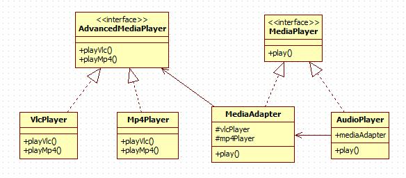

# Adapter Pattern

适配器模式（Adapter Pattern）是作为两个不兼容的接口之间的桥梁。

## 意图

将一个类的接口转换成客户希望的另外一个接口。Adapter模式使得原本由于接口不兼容而不能一起工作的那些类可以一起工作。

## 优点

1. 可以让任何两个没有关联的类一起运行。
2. 提高了类的复用。
3. 增加了类的透明度。
4. 灵活性好。

## 缺点

1. 过多地使用适配器，会让系统非常零乱，不易整体进行把握。
2. 如内部变化复杂，会有很多的建造类。

## 使用场景

1. 有动机地修改一个正常运行的系统的接口，这时应该考虑使用适配器模式。

## 注意事项

适配器不是在详细设计时添加的，而是解决正在服役的项目的问题。

## [实现](https://github.com/shiyangqin/DesignPatterns/tree/master/adapter_pattern)

