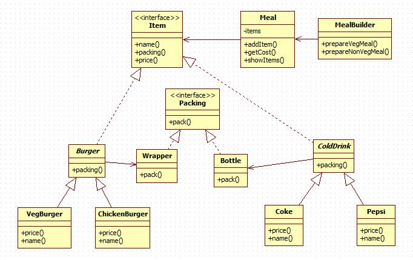

# Builder Pattern

建造者模式（Builder Pattern）使用多个简单的对象一步一步构建成一个复杂的对象。Builder 类是独立于其他对象的。

## 意图

将一个复杂的构建与其表示相分离，使得同样的构建过程可以创建不同的表示。

## 优点

1. 建造者独立，易扩展。 
2. 便于控制细节风险。

## 缺点

1. 产品必须有共同点，范围有限制。
2. 如内部变化复杂，会有很多的建造类。

## 使用场景

1. 当创建复杂对象的算法独立于该对象的组成部分以及它们的装配方式时。
2. 当构造过程必须允许被构造的对象有不同的表示时。

## 注意事项

与工厂模式的区别是：建造者模式更加关注与零件装配的顺序。

## [实现](https://github.com/shiyangqin/DesignPatterns/tree/master/builder_pattern)

