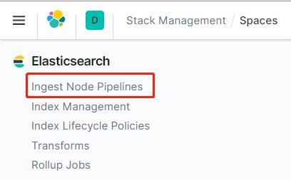
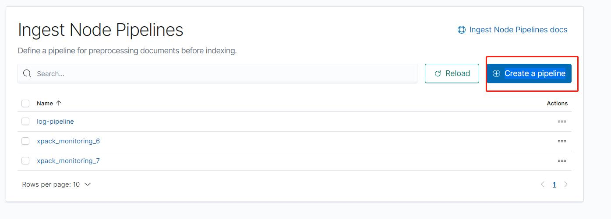
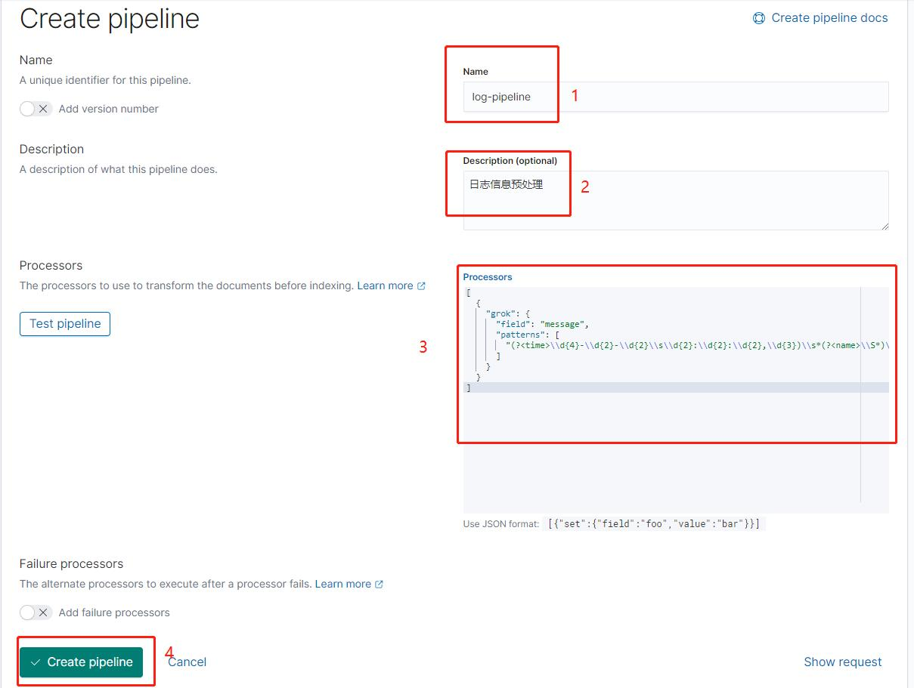
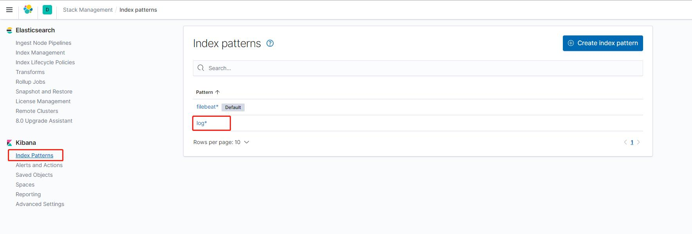
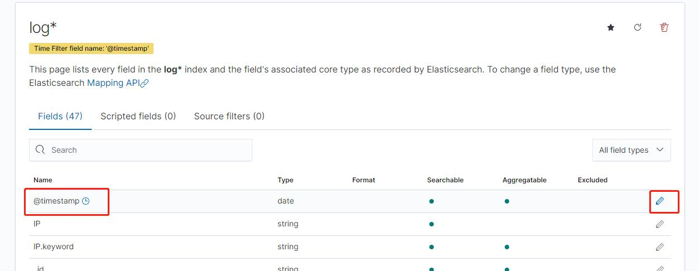
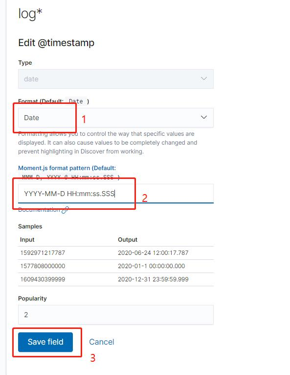
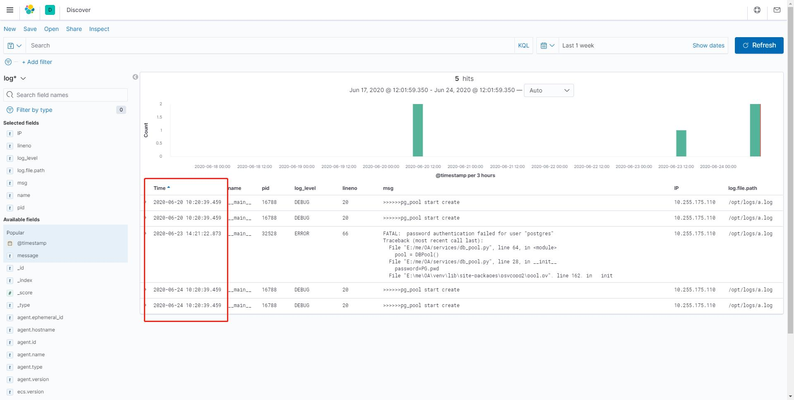

# Filebeat+Elasticsearch+Kibana日志服务器部署

功能：将多个服务器上的日志文件上传到es服务器，多行日志合并，通过 pipeline 对日志内容进行解析，将日志时间替换为上传时间，每部分内容放在独立的字段中，方便筛选

Filebeat：日志收集器

Elasticsearch：一个开源的分布式、RESTful 风格的搜索和数据分析引擎

Kibana：为 Elasticsearch 设计的开源分析和可视化平台

所用镜像版本都为：7.8

为避免版本差异，谨慎修改软件版本

## 文件结构

+ docker-compose.yml：Elasticsearch和Kibana部署文件
  + filebeat
    + filebeat.yml：filebeat配置文件
    + docker-compose.yml：filebeat部署文件

## 修改Filebeat配置文件

打开filebeat文件夹下的filebeat.yml，修改其中的日志路径、服务器IP、es服务器IP和自定义索引

修改日志路径的同时，记得修改docker-compose.yml中的文件映射

```yml
filebeat.inputs:
  - type: log
    enabled: true
    paths:
      - /opt/logs/*.log  # 日志文件路径（容器内路径）
    fields:  # 添加自定义字段，方便区分不同服务器
      IP: "服务器IP"
    fields_under_root: true
    multiline:  # 多行日志合并，不以时间开头的行，合并至上一行
      pattern: '^\d{4}-\d{2}-\d{2}'
      negate: true
      match: after
    tags: ["log"]  # 定义tags，用于自定义索引

output.elasticsearch:
  hosts: ["es服务器IP:9200"]
  indices:  # 自定义索引
    - index: "log-%{[agent.version]}-%{+yyyy.MM.dd}"
      when.contains:
        tags: "log"
```

## 部署

需先安装docker和docker compose

### 部署Kibana和es

将docker-compose.yml上传至服务器，在文件所在目录下执行docker compose命令

```shell
docker-compose up -d
```

### 配置pipeline

通过 pipeline 对日志内容进行解析

打开浏览器，输入地址：服务器IP:5601，打开 kibana


打开 Manage spaces


点击 Ingest Node Pipelines



点击 Create a pipeline 按钮



填写pipeline信息



日志格式：

```txt
2020-06-22 11:32:37,413 services.db_pool 16392 DEBUG    30     >>>>>>pg_pool create success
```

对应的 Processors 信息：

```json
[
  {
    "grok": {
      "field": "message",
      "patterns": [
        "(?<time>\\d{4}-\\d{2}-\\d{2}\\s\\d{2}:\\d{2}:\\d{2},\\d{3})\\s*(?<name>\\S*)\\s*(?<pid>\\S*)\\s*(?<log_level>\\S*)\\s*(?<lineno>\\S*)\\s*(?<msg>[\\s\\S]*)"
      ]
    }
  },
  {
    "date": {
      "field": "time",
      "formats": [
        "yyyy-MM-dd HH:mm:ss,SSS"
      ],
      "timezone": "Asia/Shanghai",
      "target_field": "@timestamp"
    }
  }
]
```

### 部署Filebeat

将filebeat文件夹上传至日志文件所在服务器，进入filebeat文件夹，修改好配置文件，执行docker compose命令

```shell
docker-compose up -d
```

### 配置Kibana

打开浏览器，输入地址：服务器IP:5601，打开 kibana


打开 Manage spaces


点击索引管理


点击创建索引


根据数据填写索引名称，点击下一步


选择 Time Filter field name，点击创建


打开Discover


修改筛选条件，查看日志内容


## 修改索引中的@timestamp格式

打开 Index patterns，点击要修改的索引



点击 @timestamp 字段后面的编辑按钮



修改Format为Date，填写想要的格式，保存



修改成功


