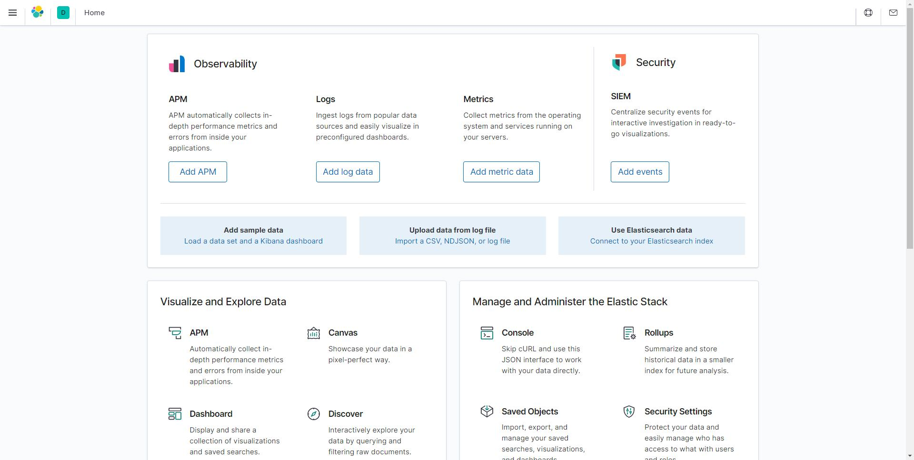
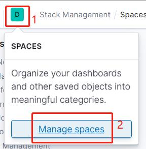
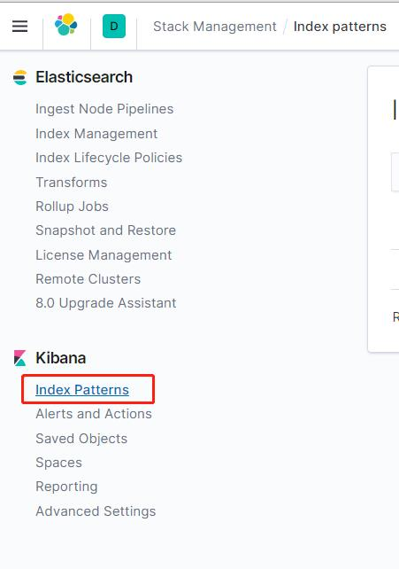
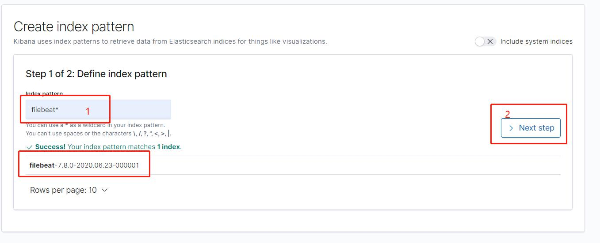
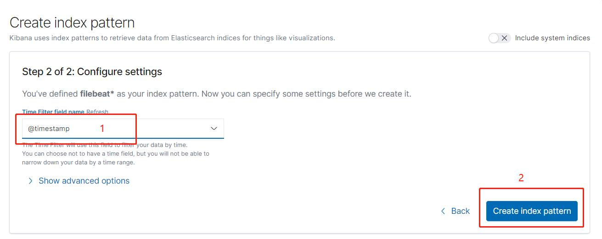
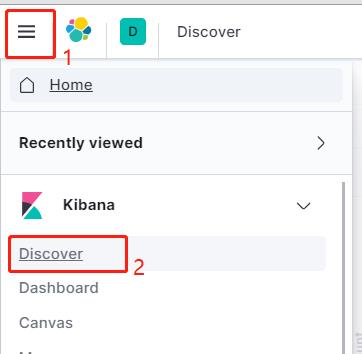
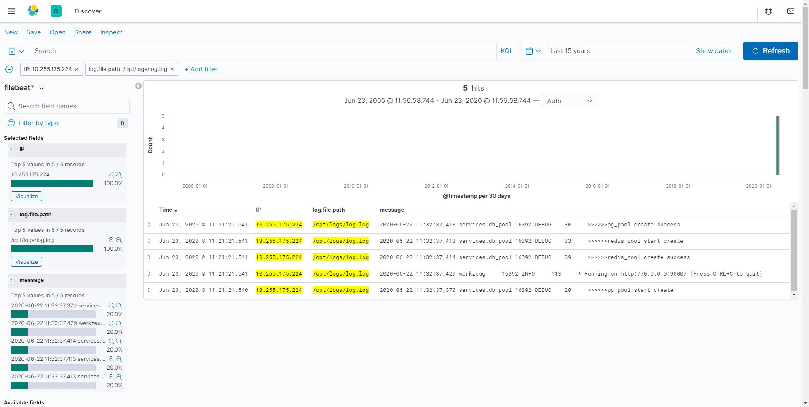

# Filebeat+Elasticsearch+Kibana日志服务器部署

Filebeat：日志收集器

Elasticsearch：一个开源的分布式、RESTful 风格的搜索和数据分析引擎

Kibana：为 Elasticsearch 设计的开源分析和可视化平台

现阶段缺点：无法解析日志文件

+ docker-compose.yml：Elasticsearch和Kibana部署文件
  + filebeat
    + filebeat.yml：filebeat配置文件
    + docker-compose.yml：filebeat部署文件

## Filebeat配置文件

```yml
filebeat.inputs:
  - type: log
    enabled: true
    paths:
      - /opt/logs/*.log  #日志文件路径（容器内路径）
    fields:
      IP: "服务器IP"
    fields_under_root: true
    multiline:  # 多行日志合并，不以时间开头的行，合并至上一行
      pattern: '^\d{4}-\d{2}-\d{2}'
      negate: true
      match: after

output.elasticsearch:
  hosts: ["es服务器IP:9200"]

```

## 部署

需先安装docker和docker compose

+ 部署Kibana和es

将docker-compose.yml上传至服务器，在文件所在目录下执行docker compose命令

```shell
docker-compose up -d
```

+ 部署Filebeat

将filebeat文件夹上传至日志文件所在服务器，进入filebeat文件夹，修改好配置文件，执行docker compose命令

```shell
docker-compose up -d
```

## 配置Kibana

打开浏览器，输入地址：服务器IP:5601，打开 kibana



打开 Manage spaces



点击索引管理



点击创建索引


根据数据填写索引名称，点击下一步



选择 Time Filter field name，点击创建



打开Discover



修改筛选条件，查看日志内容


