+ 单表：  
    + 增：  
    ```
    INSERT INTO table_name（column_name,[...]） VALUES ({ expression | DEFAULT }, [...])
    ```
    + 删：
    + 改：
    + 查：  
    ```
    SELECT column_name_s FROM table_name WHERE 条件 GROUP BY column_name HAVING 条件 ORDER BY column_name DESC/ASC OFFSET 忽略行数 LIMIT 查询行数;
    ```

# 基础sql知识

+ 增(有3种方式)

1. insert

    插入明确的值

    ```
    INSERT INTO table_name (column_name,[...]) VALUES ({ expression | DEFAULT } ,[...])
    例：
    INSERT INTO products (product_no,name,price) VALUES (1,'cheese',9.99)
    ```

    插入查询出的值

    ```
    INSERT INTO table_name (column_name,[...])
    {query}
    例：
    INSERT INTO products (produt_no,name,price)
    SELECT (product_no,name,price) FROM tmp_products WHERE price < 100
    ```

2. 直接拿现有表数据创建一个新表并填充

    ```
    SELECT <新建表列名> INTO <新建表面> FROM <源表名>
    例：
    SELECT name,address,email INTO temp_stu FROM strdents
    ```

3. copy-在一个文件和一个表之间复制数据

    ```
    postgres官网手册链接：http://www.postgres.cn/docs/9.6/sql-copy.html
    ```

+ 删(有3种方式)

1. delete:删除表中数据  

    DELETE从指定表中删除满足 WHERE子句的行。如果WHERE 子句没有出现，效果将会是删除表中的所有行。结果是一个合法的空表。

    ```
    DELETE FROM table_name[*] [USING using_list] [WHERE condition]
    例：
    DELETE FROM films USING producers WHERE producer_id = producers.id AND producers.name = 'foo
    ```

    注意：遇到大数据量的时候尽量不要用delete，如果全表数据清除，请用truncate，如果按照条件删除可将留存数据用create table as select 的形式放入新表，之后将老表truncate，将新表数据insert进老表，之后删除新表。

2. drop:删除表，包括数据和表结构

    ```
    DROP TABLE table_name
    ```

3. truncate:快速删除表中海量数据，保留表结构

    TRUNCATE可以从一组表中快速地移除所有行。 它具有和在每个表上执行无条件DELETE相同的 效果，不过它会更快，因为它没有实际扫描表。此外，它会立刻回收磁盘空间， 而不是要求一个后续的VACUUM操作。在大表上 它最有用。
    
    ```
    TRUNCATE TABLE table_name
    ```
    
+ 改
    
    ```
    UPDATE table_name SET column_name = new_value,[...] WHERE column_name = value,[...]
    例：
    UPDATE products SET price = 10 WHERE price = 5
    ```

    如遇到大数据量表的时候尽量不要用update，可以用create table h_cve_info_test as select * from h_cve_info的方式重新根据修改的条件新生成一张表，之后将老表truncate，再将新表数据插入，之后删新表。

    实例：

    ```
    create table h_cve_info_test as
    (
        select * from h_cve_info where id<500
        union all
        SELECT id,'qwer' vulnerability_title, cnvd_id, hazard_level, hazard_level_description, impact_of_product, other_id, cve_id, cve_link, 
        vulnerability_description, reference_links, vulnerability_solutions, vulnerability_discoverer, firm_patch, verify_the_information, 
        release_time, submit_time, recording_time, update_time, vulnerability_accessories, input_time, vulnerability_type, risk_type, cn_type
        FROM h_cve_info where id=500
        union all
        select * from h_cve_info where id>500
    )

    ```

+ 查

    查询是开发人员应用最多的，也是最重要的，下面要由浅到深的介绍查询时用到的知识。

    基础：

    创建一个例子，给定编号

    例一：

    ```
    create table grade (name varchar(10),subject varchar(10),score integer);
    insert into grade values('lucy','English',100);
    insert into grade values('lucy','Physics',90);
    insert into grade values('lucy','Math',85);
    insert into grade values('lily','English',95);
    insert into grade values('lily','Physics',81);
    insert into grade values('lily','Math',84);
    insert into grade values('david','English',100);
    insert into grade values('david','Physics',86);
    insert into grade values('david','Math',89);
    insert into grade values('simon','English',90);
    insert into grade values('simon','Physics',76);
    insert into grade values('simon','Math',79);

    ```

    注：如建表时未指定表空间，系统会把表建在默认的表空间中，如果需要指定表空间需要
    ```
    create table grade (name varchar(10),subject varchar(10),score integer) tablespace 表空间名;
    ```

    + 最简单的查询语句

    ```
    SELECT * FROM grade;
    ```

    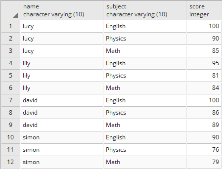

    + order by 给查询结果排序

    ```
    SELECT * FROM grade ODER BY score [DESC|ASC];
    ```

    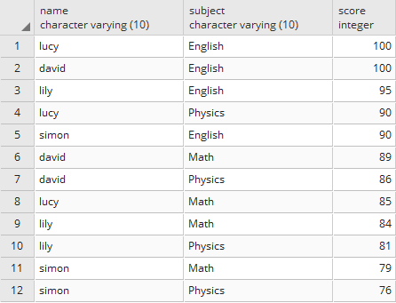

    + group by 按照某列分组

    求每人的总成绩

    ```
    SELECT name,sum(score) FROM grade GROUP BY name
    ```

    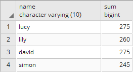

    注：在做关联操作的时候进行group by，group by有时会成为影响执行计划的因素之一，最终有可能会拖慢sql的执行速度。所以为了避免这种情况，有类似的场景可以先关联并将结果放在一个物理表中，然后再对物理表进行聚合。

    分组后排序：

    ```
    SELECT name,sum(score) FROM grade GROUP BY name ORDER BY name;
    ```

    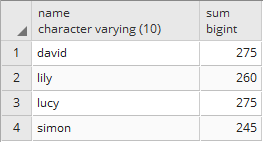

    + having子句

    HAVING子句可以让我们挑选出该函数的结果符合某些条件的特定行

    显示总成绩大于270分的name和总成绩，并按照name排序：

    ```
    SELECT name,sum(score) FROM grade GROUP BY name HAVING sum(score)>270 ORDER BY name
    ```

    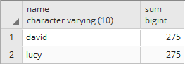

    + 注意：
    
    1. 我们不能写成 select * from grade group by name; ，因为其他字段里没有哪个值可以和每个组相关联起来。 被分组的字段可以在选择列表中引用是因为它们每个组都有单一的数值。通常，如果一个表被分了组，那么没有在分组中引用的字段都不能引用，除了在聚集表达式中以外，例如（sum，count， …）。

    2. select查询中的顺序为：SELECT FROM WHERE GROUP BY HAVING ORDER BY

    + ROW_NUMBER() OVER()

    ```
    ROW_NUMBER() OVER( [ PRITITION BY col1] ORDER BY col2[ DESC ] )
    ```
    
    解释：ROW_NUMBER()为返回的记录定义个行编号， PARTITION BY col1 是根据col1分组，ORDER BY col2[ DESC ]是根据col2进行排序。
    
    实例：

    求每门课程的最高分和其学生名

    ```
    SELECT name,subject,score FROM 
    (SELECT name,subject,score,ROW_NUMBER() OVER(PRITITION BY subject ORDER BY score DESC) rn 
    FROM grade) t WHERE t.rn<=1
    ```

    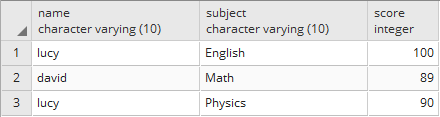

    + distinct 去重

    ```
    SELECT DISTINCT name FROM grade
    ```

    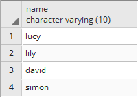

    + distinct on() 去除重复

    只显示每个人的最高成绩或最低成绩

    ```
    SELECT DISTINCT ON(name) name,score FROM grade ORDER BYU name,score [DESC|ASC]
    ```

    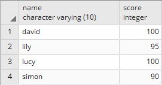

    注意：

    1. 如果要排序去重的话，distinct on (column)的column必须要出现在order by里面
    2. distinct和distinct on()的区别:  
    distinct：select后面列出的所有列，只要有一个列数据不一样都算作单独的一条数据。  
    distinct on(column)：把记录根据column的值进行分组，分组之后仅返回每一组的第一行。需要注意的是，如果你不指定ORDER BY子句，返回的第一条的不确定的。

    + 以上都是单表查询，下面介绍多表联合查询

    创建另一个表，给定编号：

    例二：

    ```
    create table subjects (id integer,subject varchar(10),teacher varchar(10));
    insert into subjects values(1,'English','tom');
    insert into subjects values(2,'Physics','jack');
    insert into subjects values(3,'Math','mark');
    insert into subjects values(4,'chinese','ming');

    insert into grade values('li','chemistry',60);
    ```

    + 简单的多表查询

    ```
    SELECT name,grade.subject,score,teacher FROM grade,subjects WHERE name ='lucy';
    ```

    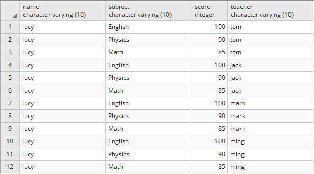

    注意：
    
    1. 以上语句的执行顺序：  
	①先把grade,subjects表做笛卡儿积，做完笛卡儿积也就是有12X4=48条数据。  
	②在执行where后面的条件name ='lucy'，选出匹配的数据。
    
    2. 根据①的描述，如果两个表的数据量都非常的大，做笛卡儿积时有可能造成效率大幅降低。
    
    3. 表grade中有subject列，表subjects中也有subject列，所以如果select后边的subject列如果不指明，就会报错“ERROR:  column reference "subject" is ambiguous”

    如果遇到大数据量表进行关联的时候，避免多表进行关联，可以两个表进行关联生成一个新的物理表，之后将物理表再与其他表进行关联。以此类推。这样的好处是代码结构清晰，执行效率高

    + join 子句

    + cross join 交叉连接

    交叉连接匹配的第一个表与第二个表中的每一行的每一行。由于交叉联接有可能产生非常大的表，必须谨慎，只在适当的时候使用它们。

    ```
    SELECT name,grade.subject,score,teacher FROM grade,subjects WHERE name='lucy'
    ```
    等同于
    ```
    SELECT name,grade.subject,score,teacher FROM grade,subjjects WHERE name='lucy'
    ```

    

    + inner join 内连接

    inner join 创建一个新的结果表，通过结合两个表（表1和表2）根据联接谓词的列值。查询比较table1，table2中的每一行，找到所有对满足连接谓词的行。当联接谓词满足table1和table2每个对相匹配的行，列的值合并成一个结果行。

    ```
    SELECT name,grade.subject,score,teather
    FROM grade INNER JOIN subjects ON grade.subject=subjects.subject
    WHERE name='lucy' 
    ```

    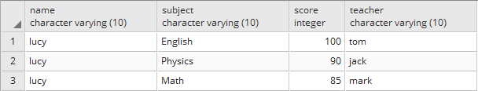

    + left outer join 左外连接

    left outer join的情况下，先进行内部联接。然后，如果表1中有一行并不满足连接条件的表2中的任何行，则连接以后保留表1中的行，该行对应的表2的列值用null填充

    ```
    SELECT * FROM subjects s LEFT OUTER JOIN grade g ON s.subject=g.subject
    ```

    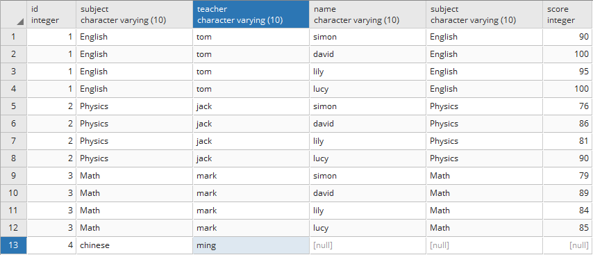

    + right outer join 右外连接

    right outer join的情况下，先进行内部联接。然后，如果表2中有一行并不满足联接条件的表1中的任何行，则连接以后保留表2中的行，该行对应的表1的列值用null填充。与left outer join相反

    ```
    SELECT * FROM subjects s RIGHT OUTER JOIN grade g ON s.subject=g.subject
    ```

    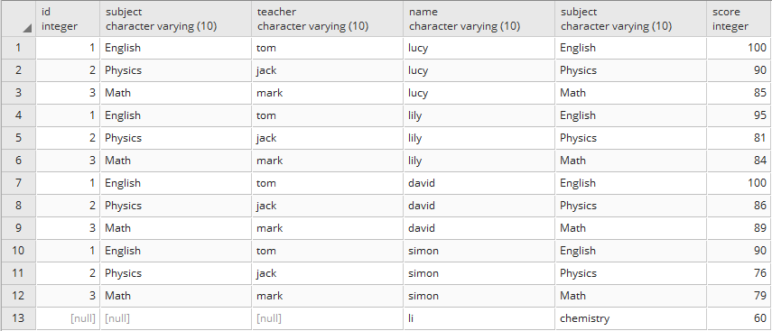

    + full outer join 全外连接

    首先，进行内部联接。然后，如果表1中有一行并不满足连接条件的表2中的任何行，则连接以后保留表1中的行，该行对应的表2的列值用null填充。如果表2中有一行并不满足连接条件的表1中的任何行，则连接以后保留表2中的行，该行对应的表1的列值用null填充。相当于left outer join和right outer join 的结合。

    ```
    SELECT * FROM subjects s FULL OUTER JOIN grade g ON s.subject=g.subject
    ```

    

    + union | union all 子句

    1. union  
    
    PostgreSQL的UNION子句/运算符用于合并两个或多个SELECT语句的结果，不返回任何重复的行。  
    
    直接使用UNION，每个SELECT选择的列数必须具有相同的，相同数目的列表达式相同的数据类型，并让它们在相同的顺序，但它们不必是相同的长度。

    ```
    SELECT * FROM grade WHERE name='lily'
    UNION
    SELECT * FROM grade WHERE name='lucy' OR name='lily'
    ```

    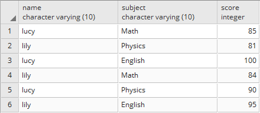

    2. union all  

    UNION ALL运算符是用来结合两个SELECT语句，包括重复行的结果。其余规则同UNION相同。

    ```
    SELECT * FROM grade WHERE name='lily'
    UNION ALL
    SELECT * FROM grade WHERE name='lucy' OR name='lily'
    ```

    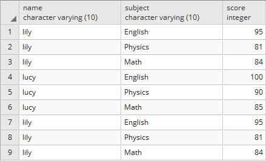

    + intersect | intersect all

    intersect返回那些同时存在与query1和query2的结果中的行，除非声明了intersect all，否则所有重复行都被清除。查询2个结果的交集

    ```
    (
    select * from grade where name='simon' or name='lily'
    union all 
    select * from grade where name='lily'
    )
    intersect
    (
    select * from grade where name='lucy' or name='lily'
    union all 
    select * from grade where name='lily'
    )
    ```

    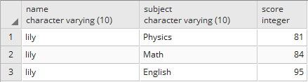

    ```
    (
    select * from grade where name='simon' or name='lily'
    union all 
    select * from grade where name='lily'
    )
    intersect all
    (
    select * from grade where name='lucy' or name='lily'
    union all 
    select * from grade where name='lily'
    )
    ```

    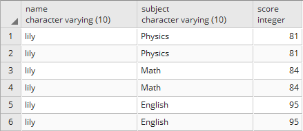

    + except | except all

    EXCEPT返回所有在query1的结果中但是不在query2的结果中的行（有时侯这叫做两个查询的差）。同样的，除非声明了EXCEPT ALL，否则所有重复行都被消除。

    ```
    (
    select * from grade where name='lucy' or name='lily'
    union all 
    select * from grade where name='lily'
    )
    except
    select * from grade where name='lucy'
    ```

    

    ```
    (
    select * from grade where name='lucy' or name='lily'
    union all 
    select * from grade where name='lily'
    )
    except all
    select * from grade where name='lucy'
    ```

    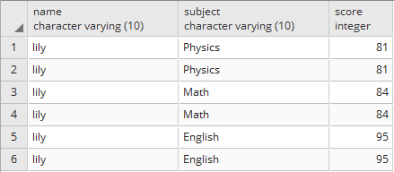

    + limit 和 offset

    limit 和 offset允许你只检索查询剩余部分产生的行的一部分：

    ```
    SELECT select_list
    FROM table_expression
    [ ORDER BY ... ]
    [ LIMIT { number | ALL } ] [ OFFSET number ]

    ```

    如果给出了一个限制计数，那么会返回数量不超过该限制的行（但可能更少些，因为查询本身可能生成的行数就比较少）。LIMIT ALL的效果和省略LIMIT子句一样，就像是LIMIT带有 NULL 参数一样。 

    OFFSET说明在开始返回行之前忽略多少行。OFFSET 0的效果和省略OFFSET子句是一样的，并且LIMIT NULL的效果和省略LIMIT子句一样，就像是OFFSET带有 NULL 参数一样。 
    
    如果OFFSET和LIMIT都出现了， 那么先忽略OFFSET行再返回LIMIT个行。在select 表的时候要习惯加上limit，如果不加pg数据库默认要加载所有数据，非常慢也没有必要。

    举例：

    ```
    SELECT * FROM grade ORDER BY score DESC LIMIT 5
    ```

    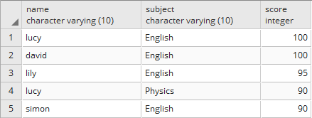

    ```
    SELECT * FROM grade ORDER BY score DESC LIMIT 5 OFFSET 2
    ```

    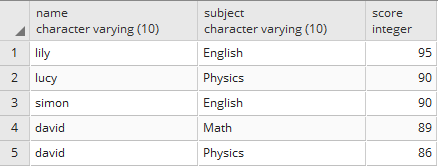

    + 子查询应用

    子查询可以在很多地方用到：select、insert、update、delete。不管用在什么地方，其原理都是相似的。

    在select语句中常用的子查询：（在例一的基础上）

    显示分数大于平均值的人

    ```
    SELECT name FROM grade WHERE score>(SELECT avg(score) FROM grade)
    ```

    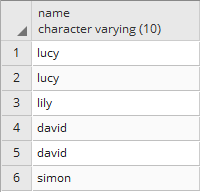

    在insert语句中常用的子查询：

    ```
    INSERT INTO grade (name,subject,score) SELECT * FROM grade WHERE score=95
    ```

    在update语句中常用的子查询：

    ```
    UPDATE grade SET score=1.5*score WHERE score<(SELECT avg(score) FROM grade)
    ```

    在delete语句中常用的子查询：

    ```
    DELETE FROM grade WHERE score>(SELECT avg(score) FROM  grade)
    ```

    注意：  
    1. 子查询必须用括号括起来
    2. 子查询返回多于一行只能用于使用多值的运算符，如IN，EXISTS，IN，ANY / SOME，ALL运算符。
    3. BETWEEN运算符不能与子查询一起使用; 但是，BETWEEN可以在子查询中使用。
    4. 子查询在SELECT子句中只能有一列，除非主查询中有多个列用于比较其所选列的子查询。

    经验： 子查询可以多层嵌套，在写这样的select语句时可以先写好最内层的子查询备用，再一层一层的往上写，最后再拼接到一起。
    
    + select 调用函数

    ```
    select function_name(parameters,...)
    ```

# PostgreSQL函数

官网链接：http://www.postgres.cn/docs/9.6/functions.html