# DataStructures

+ [栈](#栈)
+ [链表](#链表)
+ [数组](#数组)
+ [哈希表](#哈希表)
+ [队列](#队列)
+ [树](#树)
  + [完全二叉树](#完全二叉树)
  + [堆](#堆)
  + [二叉搜索树](#二叉搜索树)
  + [平衡二叉树](#平衡二叉树)
  + [红黑树](#红黑树)
  + [B树](#B树)
  + [B+树](#B+树)
+ [图](#图)
  + [图的表示](#图的表示)
  + [图的搜索](#图的搜索)
  + [最小生成树](#最小生成树)

## 栈

后进先出

可以用数组实现

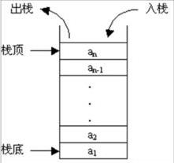

## 链表

单链表、双链表、循环链表

内存不连续

新增、删除：快，只需要修改相邻节点

查找：慢，需要遍历

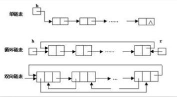

## 数组

内存连续

新增、删除：慢，需要调整元素位置

查询：可以通过角标快速查询

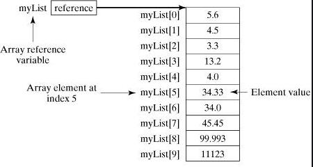

## 哈希表

一个数组，数组中每个元素都是链表

根据元素的一些特征把元素分配到不同的链表中去，也是根据这些特征，找到正确的链表，再从链表中找出这个元素

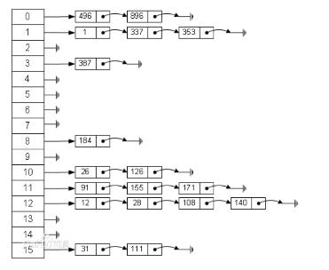

## 队列

只允许在一端进行插入，在另一端进行删除操作的线性表

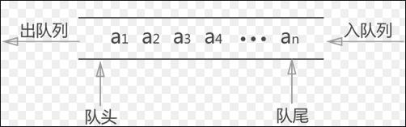

双端队列：只允许在两端进行插入和删除操作的线性表

## 树

+ 树的遍历

    前序遍历：根结点 ---> 左子树 ---> 右子树

    中序遍历：左子树 ---> 根结点 ---> 右子树

    后序遍历：左子树 ---> 右子树 ---> 根结点

### 完全二叉树

在深度为h的二叉树中，除了h层外，其他层节点数都达到最大，h层所有节点都连续集中在左边

满二叉树：h层节点数也达到最大的完全二叉树

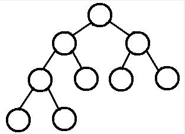

### 堆

在树中，各节点的值都不大于或不小于子节点的完全二叉树

最大堆：各节点值不小于子节点的堆

最小堆：各节点值不大于子节点的堆

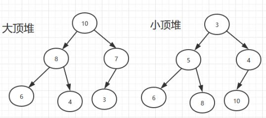

### 二叉搜索树

左结点小于根节点，右结点大于根节点的二叉树树

查找、插入、删除的时间复杂度为O（logN），但有极端情况，就是会变成一种线性链表似的结构，此时时间复杂度就变味了O（N），为了解决这种情况，出现了二叉平衡树。

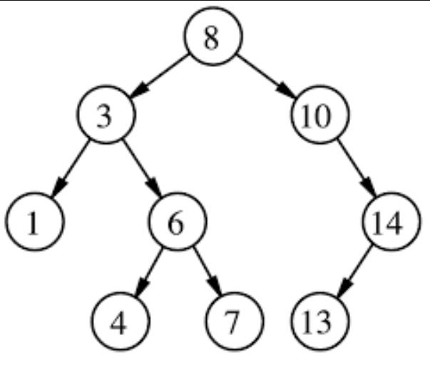

### 平衡二叉树

又叫平衡二叉搜索树、AVL

左结点小于根节点，右结点大于根节点。并且还规定了所有节点的左子树和右子树的高度差不得超过1

查找稳定，查找、插入、删除的时间复杂度都为O(logN)

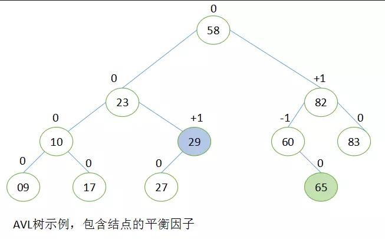

### 红黑树

红黑树保证了最坏情形下在 O(logn) 时间复杂度内完成查找、插入及删除操作

红黑树确保没有一条路径会比其他路径长出2倍，因而是近似于平衡的

一颗红黑树是满足下列条件的二叉搜索树：

1. 每个节点或者是黑色，或者是红色。
2. 根节点是黑色。
3. 每个叶节点（NIL）是黑色。
4. 每个红色结点的两个子结点一定都是黑色。
5. 任意一结点到每个叶子结点的路径都包含数量相同的黑结点。

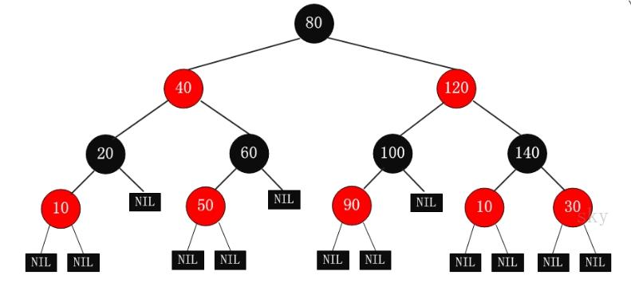

### B树

一个 m 阶的B树是一个有以下属性的树：

1. 每一个节点最多有 m 个子节点
2. 如果根节点不是叶子节点，那么它至少有两个子节点
3. 每一个非叶子节点（除根节点）最少有 ⌈m/2⌉ 个子节点
4. 有 k 个子节点的非叶子节点拥有 k − 1 个键
5. 所有的叶子节点都在同一层

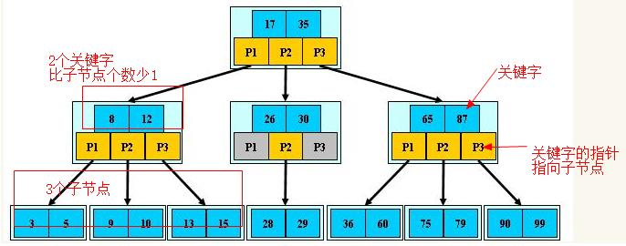

### B+树

B+树每个非叶子结点存放的元素只用于索引作用，所有数据保存在叶子结点。

一个m阶的B+树规定了：

1. 有k个子树的中间节点包含有k个元素（B树中是k-1个元素），每个元素不保存数据，只用来索引，所有数据都保存在叶子节点。
2. 所有的叶子结点中包含了全部元素的信息，及指向含这些元素记录的指针，且叶子结点本身依关键字的大小自小而大顺序链接。
3. 所有的中间节点元素都同时存在于子节点，在子节点元素中是最大（或最小）元素。

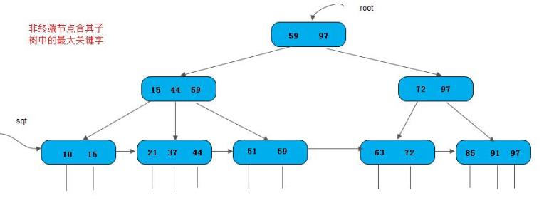

## 图

### 图的表示

图是由顶点和边组成的(可以无边，但至少包含一个顶点)：

+ 一组顶点：通常用 V(vertex) 表示顶点集合
+ 一组边：通常用 E(edge) 表示边的集合

图可以分为有向图和无向图，在图中：

+ (v, w) 表示无向边，即 v 和 w 是互通的
+ <v, w> 表示有向边，该边始于 v，终于 w

图可以分为有权图和无权图：

+ 有权图：每条边具有一定的权重(weight)，通常是一个数字
+ 无权图：每条边均没有权重，也可以理解为权为 1

图又可以分为连通图和非连通图：

+ 连通图：所有的点都有路径相连
+ 非连通图：存在某两个点没有路径相连

图中的顶点有度的概念：

+ 度(Degree)：所有与它连接点的个数之和
+ 入度(Indegree)：存在于有向图中，所有接入该点的边数之和
+ 出度(Outdegree)：存在于有向图中，所有接出该点的边数之和

图的表示：

1. 邻接矩阵：

    + 在 n 个顶点的图需要有一个 n × n 大小的矩阵
    + 在一个无权图中，矩阵坐标中每个位置值为 1 代表两个点是相连的，0 表示两点是不相连的
    + 在一个有权图中，矩阵坐标中每个位置值代表该两点之间的权重，0 表示该两点不相连
    + 在无向图中，邻接矩阵关于对角线相等

2. 邻接链表：

    + 对于每个点，存储着一个链表，用来指向所有与该点直接相连的点
    + 对于有权图来说，链表中元素值对应着权重

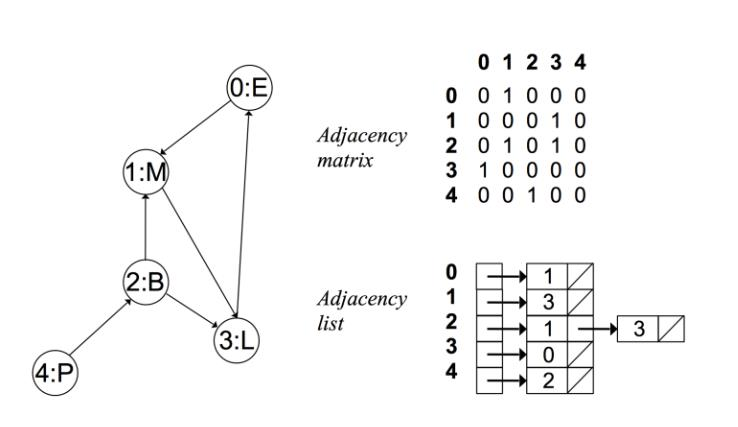

### 图的搜索

+ 深度优先搜索

    基本思路：深度优先遍历图的方法是，从图中某顶点 v 出发

    1. 访问顶点 v
    2. 从 v 的未被访问的邻接点中选取一个顶点 w，从 w 出发进行深度优先遍历
    3. 重复上述两步，直至图中所有和v有路径相通的顶点都被访问到

+ 广度优先搜索

    实现思路：

    1. 顶点 v 入队列
    2. 当队列非空时则继续执行，否则算法结束
    3. 出队列取得队头顶点 v；访问顶点 v 并标记顶点 v 已被访问
    4. 查找顶点 v 的第一个邻接顶点 col
    5. 若 v 的邻接顶点 col 未被访问过的，则 col 继续
    6. 查找顶点 v 的另一个新的邻接顶点 col，转到步骤 5 入队列，直到顶点 v 的所有未被访问过的邻接点处理完。转到步骤 2

### 最小生成树

例如：要在 n 个城市之间铺设光缆，主要目标是要使这 n 个城市的任意两个之间都可以通信，但铺设光缆的费用很高，且各个城市之间铺设光缆的费用不同，因此另一个目标是要使铺设光缆的总费用最低。这就需要找到带权的最小生成树。

特点：

1. 该树是连通的
2. 权值之和最小
3. 边数比顶点个数少 1

存在个数：最小生成树在一些情况下可能会有多个

1. 当图的每一条边的权值都相同时，该图的所有生成树都是最小生成树
2. 如果图的每一条边的权值都互不相同，那么最小生成树将只有一个

生成最小生成树的算法一般有两种，分别是 Prim 算法和 Kruskal 算法:

+ 普里姆算法 (Prim 算法):

    算法步骤：

    1. 输入：一个加权连通图，其中顶点集合为 V，边集合为 E
    2. 初始化：Vnew = {x}，其中 x 为集合 V 中的任一节点(起始点)，Enew = {} 为空
    3. 在集合 E 中选取权值最小的边 <u, v>，其中 u 为集合 Vnew 中的元素，而 v 不在 Vnew 集合当中，并且 v∈V (如果存在有多条满足前述条件即具有相同权值的边，则可任意选取其中之一）
    4. 将 v 加入集合 Vnew 中，将 <u, v> 边加入集合 Enew 中
    5. 重复步骤 3、4 直到 Vnew = V

    时间复杂度：O(V^2)

+ Kruskal 算法：需要一个集合用来升序存储所有边

    算法步骤：

    1. 先构造一个只含有 n 个顶点，而边集为空的子图
    2. 从边集 E 中选取一条权值最小的边，若该条边的两个顶点分属不同的树，则将其加入子图。(也就是说，将这两个顶点分别所在的两棵树合成一棵树) 反之，若该条边的两个顶点已落在同一棵树上，则不可取，而应该取下一条权值最小的边再试之
    3. 重复步骤 2，直到所有点连通

    时间复杂度：O( ElogV )
