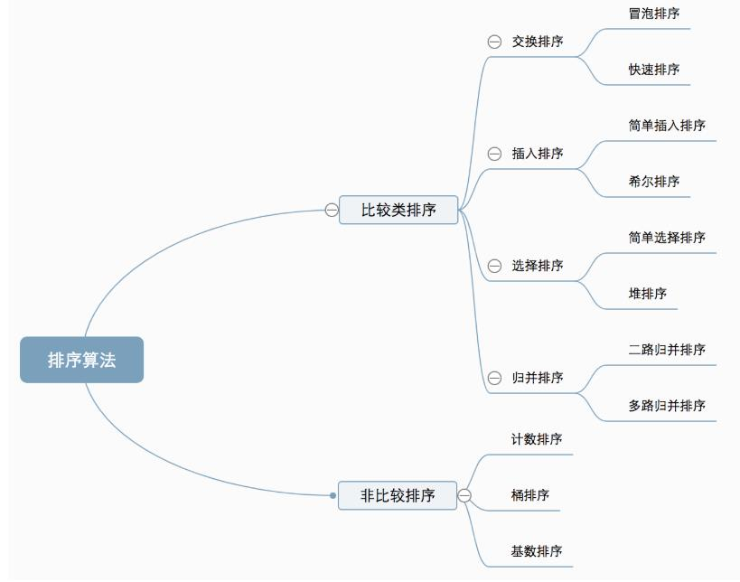

# 排序算法

参考文档：https://www.cnblogs.com/onepixel/p/7674659.html

## 排序算法分类

十种常见排序算法可以分为两大类：

+ 比较类排序：通过比较来决定元素间的相对次序，由于其时间复杂度不能突破O(nlogn)，因此也称为非线性时间比较类排序。
+ 非比较类排序：不通过比较来决定元素间的相对次序，它可以突破基于比较排序的时间下界，以线性时间运行，因此也称为线性时间非比较类排序。

## 排序算法时间复杂度

排序算法|时间复杂度（平均）|时间复杂度（最坏）|时间复杂度（最好）|空间复杂度|稳定性
-|-|-|-|-|-
插入排序|O（n2）|O（n2）|O（n）|O（1）|稳定
希尔排序|O（n1.3）|O（n2）|O（n）|O（1）|不稳定
选择排序|O（n2）|O（n2）|O（n2）|O（1）|不稳定
堆排序|O（nlog2n）|O（nlog2n）|O（nlog2n）|O（1）|不稳定
冒泡排序|O（n2）|O（n2）|O（n）|O（1）|稳定
快速排序|O（nlog2n）|O（n2）|O（nlog2n）|O（nlog2n）|不稳定
归并排序|O（nlog2n）|O（nlog2n）|O（nlog2n）|O（n）|稳定
 | | | | |  
计数排序|O（n+k）|O（n+k）|O（n+k）|O（n+k）|稳定
桶排序|O（n+k）|O（n2）|O（n）|O（n+k）|稳定
基数排序|O（n*k）|O（n*k）|O（n*k）|O（n+k）|稳定

