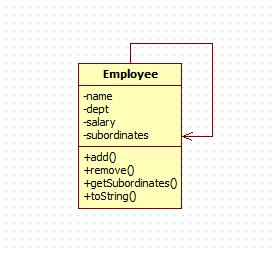

# Composite Pattern

组合模式依据树形结构来组合对象，用来表示部分以及整体层次。

## 意图

将对象组合成树形结构以表示"部分-整体"的层次结构。组合模式使得用户对单个对象和组合对象的使用具有一致性。

## 优点

 1. 高层模块调用简单。
 2. 节点自由增加。

## 缺点

在使用组合模式时，其叶子和树枝的声明都是实现类，而不是接口，违反了依赖倒置原则。

## 使用场景

1. 表示对象的部分-整体层次结构，且要求具备统一行为（如树形菜单，操作系统目录结构，公司组织架构等）；

## 注意事项

定义时为具体类。

## [实现](https://github.com/shiyangqin/DesignPatterns/tree/master/composite_pattern)

