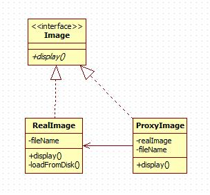

# Proxy Pattern

在代理模式中，一个类代表另一个类的功能。我们创建具有现有对象的对象，以便向外界提供功能接口。

## 意图

为其他对象提供一种代理以控制对这个对象的访问。

## 优点

1. 职责清晰。
2. 高扩展性。
3. 智能化。

## 缺点

 1. 由于在客户端和真实主题之间增加了代理对象，因此有些类型的代理模式可能会造成请求的处理速度变慢。
 2. 实现代理模式需要额外的工作，有些代理模式的实现非常复杂。

## 使用场景

远程代理

虚拟代理

保护代理

此外还有防火墙代理，智能引用代理，缓存代理，同步代理，复杂隐藏代理，写入时复制代理等等，都有各自特殊的用途

## 注意事项

 1. 和适配器模式的区别：适配器模式主要改变所考虑对象的接口，而代理模式不能改变所代理类的接口。
 2. 和装饰器模式的区别：装饰器模式为了增强功能，而代理模式是为了加以控制。

## [实现](https://github.com/shiyangqin/DesignPatterns/tree/master/proxy_pattern)

