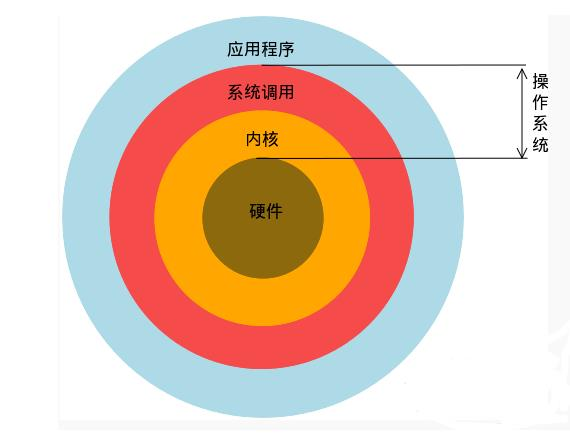

# Linux是什么与如何学习

Linux 是一个操作系统

如何学习：

1. 硬件
2. 安装与命令
3. 操作系统的基础技能
4. vi
5. shell
6. 软件管理
7. 网络

Linux历史：略

Linux本身就是个最普通的操作系统，其开发网站是 https://www.kernel.org，我们亦称Linux操作系统最底层的数据为“内核（Kernel）”

常见的Linux发行版有“商业、社区”分类法，或“RPM、DPKG分类法”
