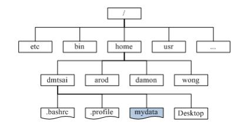
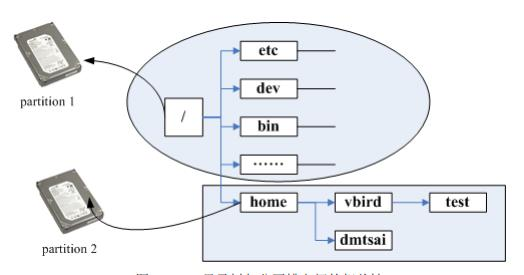

# 主机规划与磁盘分区

## 各硬件再Linux中的文件名

在Linux系统中，每个设备都被当成一个文件来对待

常见的设备与其在Linux当中的文件名：

|设备|设备在Linux中的文件名|
|-|-|
SCSI、SATA、USB磁盘驱动器|/dev/sd[a-p]
U盘|/dev/sd[a-p]（与SATA相同）
Virtio接口|/dev/vd[a-p]（用于虚拟机内）
软盘驱动器|/dev/fd[0-7]
打印机|/dev/lp[0-2]（25针打印机） /dev/usb/lp[0-15]（USB接口）
鼠标|/dev/input/mouse[0-15]（通用） /dev/psaus（PS/2接口） /dev/mouse（当前鼠标）
CD-ROM、DVD-ROM|/dev/scd[0-1]（通用） /dev/sr[0-1]（通用，CentOS较常见） /dev/cdrom（当前CD-ROM）
磁带机|/dev/ht0（IDE接口） /dev/st0（SATA/SCSI接口） /dev/sape（当前磁带）
IDE磁盘驱动器|/dev/hd[a-d]（旧系统才有）

## 磁盘分区

整个Linux最重要的地方就在于目录树架构，所谓的目录树架构（directory tree）就是以根目录为主，然后向下呈现为分支状的目录结构的一种文件架构。所以，整个目录树架构最重要的就是那个根目录（root directory），这个根目录的表示方法为一条斜线“/”，所有的文件都与目录树有关。

长方形为目录，波浪形为文件

## 文件系统与目录树的关系（挂载）

所谓的“挂载”就是利用一个目录当成进入点，将磁盘分区的数据放置在该目录下；也就是说进入该目录就可以读取该分区的意思

