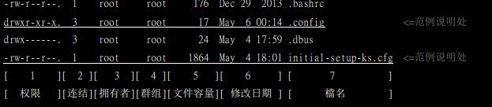
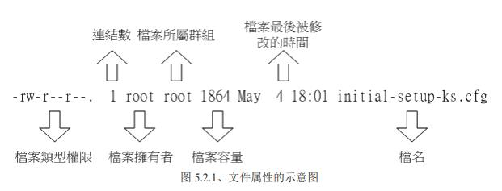

# Linux的文件权限与目录配置

## 文件

### 文件权限

任何一个文件都具有用户（User）、所属群组（Group）、其他人（Others）

root可以看到所有文件



___



___


+ 第一栏代表文件的类型和权限

    第一个字符代表这个文件是目录、文件或链接文件等等：

    1. d: 目录
    2. -: 文件
    3. l: 连结档
    4. b: 装置文件里面的可供存储的接口设备（可随机存取装置）
    5. c: 装置文件里面的串行端口设备，例如键盘、鼠标（一次性读取装置）

    接下来字符三个为一组，且均为[rwx]，r代表可读（read），w代表可写（write），x代表可执行（execute），这三个权限的位置不会改变，如果没有权限，jiu'hui出现“-”:

    1. 第一组：文件拥有者可具备的权限
    2. 第二组：加入此群组的账号的权限
    3. 第三组：其他人的权限

+ 第二栏代表有多少文件名链接到此节点
+ 第三栏代表文件的拥有者
+ 第四栏代表文件所属用户组
+ 第五栏代表这个文件的容量大小，单位默认为Bytes
+ 第六栏代表这个文件的创建日期或最近修改日期
+ 第七栏代表文件名

### 修改文件权限

+ chgrp: 修改文件所属用户组

```shell
chgrp [所属群组] [文件或目录...]
```

+ chown: 修改文件拥有者

```shell
chown user[:group] file...
```

+ chmod: 修改文件权限

第一种修改方法：

Linux的文件权限有9个，分别属于用户、用户组、其他人三种身份

|权限|数字|
|-|-|
r|4
w|2
x|1

每种身份各自的三个权限累加，就得到了3位数的权限数字，例如：-rwxr-xr--的权限数字就是754

```shell
chmod 754 file
```

第二种修改方法：
||||||
|-|-|-|-|-|
chmod|u（拥有者）<br>g（用户组）<br>o（其他人）<br>a（所有人）|+（加入）<br>-（移除）<br>=（设置）|r<br>w<br>x|文件或目录

```shell
chmod u+x,go=rx file
chmod +x file 相当于 chmod a+x file
```

### 文件种类和拓展名

+ 文件种类
  + 常规文件（regular file）
    + 纯文本文件（ASCLL）
    + 二进制文件（binary）
    + 数据文件（data）
  + 目录（directory）
  + 链接文件（link）
  + 设备与设备文件（device）
    + 区块（block）设备文件
    + 字符（character）设备文件
  + 数据接口文件（sockets）
  + 数据传输文件（FIFO，pipe）

+ 文件拓展名
  + \*.sh
  + \*Z、\*.tar、\*.tar.gz、\*.zip、\*.tgz
  + \*.html、\*.php

+ 文件名长度限制：单一文件或目录的最大容许文件名位255字节，以ASCLL英文占用一个字节来说，则大约可达255个字符长度，若以每个汉字占用2字节来说，最大文件名大约在128个汉字之间

+ 文件名限制：避免特殊符号

## 目录配置

Linux目录配置的依据——FHS（Filesystem Hierarchy Standard）

四种类型：

+ 可分享：可以分享给其他目录挂载使用的目录，所以包括执行文件与用户的邮件等数据，是能够分享给网络上其他主机挂载用的目录
+ 不可分享：自己机器上面运行的设备文件或是与程序有关的socket文件，由于仅与自身机器有关，所以当然就不适合分享给其他主机
+ 不变：有些数据是不会经常变动的，跟随着发行版而不变动。例如函数库、文件说明、系统管理员所管理的主机服务配置文件等
+ 可变动：经常修改的数据，例如：日志文件、一般用户可自行接收的新闻组等

FHS针对目录树架构仅定义出三层目录下面应该放置什么数据而已，分别是下面这三个目录的定义：

+ /（root，根目录）：与启动系统有关
+ /usr（unix software resourse）：与软件安装/执行有关
+ /var（variable）：与系统运行过程有关

### 根目录（/）的意义与内容

根目录是整个系统最重要的一个目录，不但所有的目录都是由根目录衍生出来，同时根目录也与启动、还原、系统修复等操作有关。

FHS标准建议：根目录（/）所在分区应该越小越好，且应用程序所安装的软件最好不要与根目录放在同一个分区内，保持根目录越小越好。如此不但性能较佳，根目录所在的文件系统也较不容易发生问题

|目录|应放置文件内容|
|-|-|
||
第一部分|FHS要求必须要存在的目录
||
/bin| bin是Binary的缩写, 这个目录存放着最经常使用的命令。
/boot|这里存放的是启动Linux时使用的一些核心文件，包括一些连接文件以及镜像文件。
/dev|dev是Device(设备)的缩写, 该目录下存放的是Linux的外部设备，在Linux中访问设备的方式和访问文件的方式是相同的。
/etc|这个目录用来存放所有的系统管理所需要的配置文件和子目录。
/lib|这个目录里存放着系统最基本的动态连接共享库，其作用类似于Windows里的DLL文件。几乎所有的应用程序都需要用到这些共享库。
/media|linux 系统会自动识别一些设备，例如U盘、光驱等等，当识别后，linux会把识别的设备挂载到这个目录下。
/mnt|系统提供该目录是为了让用户临时挂载别的文件系统的，我们可以将光驱挂载在/mnt/上，然后进入该目录就可以查看光驱里的内容了。
/opt|这是给主机额外安装软件所摆放的目录。比如你安装一个ORACLE数据库则就可以放到这个目录下。默认是空的。
/run|是一个临时文件系统，存储系统启动以来的信息。当系统重启时，这个目录下的文件应该被删掉或清除。如果你的系统上有 /var/run 目录，应该让它指向 run。
/sbin|s就是Super User的意思，这里存放的是系统管理员使用的系统管理程序。
/srv| 该目录存放一些服务启动之后需要提取的数据。
/tmp|这个目录是用来存放一些临时文件的。
/usr|第二层FHS设置，后续介绍
/var|第二层FHS设置，主要为放置变动性的数据，后续介绍
||
第二部分|FHS建议可以存在的目录
||
/home|用户的主目录，在Linux中，每个用户都有一个自己的目录，一般该目录名是以用户的账号命名的。
/lib\<qual\>|用来存放与/lib不同的格式的二进制函数库，例如支持64位的/lib64函数库
/root|该目录为系统管理员，也称作超级权限者的用户主目录。
||
第三部分|FHS没有定义但也需要了解一下
||
/lost+found|这个目录一般情况下是空的，当系统非法关机后，这里就存放了一些文件。
/proc|这个目录是一个虚拟的目录，它是系统内存的映射，我们可以通过直接访问这个目录来获取系统信息。这个目录的内容不在硬盘上而是在内存里，我们也可以直接修改里面的某些文件，比如可以通过下面的命令来屏蔽主机的ping命令，使别人无法ping你的机器：echo 1 > /proc/sys/net/ipv4/icmp_echo_ignore_all
/sys|这个目录其实和/proc非常类似，也是一个虚拟的文件系统，主要也是记录内核与系统硬件信息相关的内容。包括目前已加载的内核模式与内核检测到的硬件设备信息等，这个目录同样不占硬盘容量

### /usr的意义与内容

依据FHS的基本定义，/usr里面放置的数据属于可分享与不可变动，可以使用NFS服务器将/usr分享给局域网络内的其他主机来使用

|目录|应放置文件内容|
|-|-|
||
第一部分|FHS要求必须要存在的目录
||
/usr/bin|系统用户使用的应用程序。
/usr/lib|与/lib功能相同，/lib就是链接到此目录中的
/usr/local|系统管理员在本机安装自己下载的软件，建议安装到此目录，这样会比较便于管理
/usr/sbin|与/sbin功能相同，/sbin就是链接到此目录中的
/usr/share|主要放置只读的数据文件，当然也包括共享文件，在这个目录下放置的数据几乎是不分硬件架构均可读取的文件，因为几乎都是文本文件。在此目录下常见的还有这些子目录：/usr/share/man（在线帮助文档），/usr/share/doc（软件的说明文档），/usr/share/zoneinfo（与时区有关的时区文件）
||
第二部分|FHS建议可以存在的目录
||
/usr/games|与游戏比较相关的数据放置处
/usr/include|c/c++等程序语言的头文件和包含文件放置处，当我们以Tarball方式（*.tar.gz的方式安装软件）安装某些程序时，会使用到里面的许多文件
/usr/libexec|某些不被一般用户常用的执行文件或者脚本等，都会放置在此目录中。例如大部分的X窗口下面的操作命令，很多都放在此目录下
/usr/lib\<qual\>|与/lib\<qual\>功能相同，/lib\<qual\>就是链接到此目录中的
/usr/src|一般源代码建议放置到这里，src由source的意思。至于内核源代码则建议放置到/usr/src/Linux目录下

### /var的意义与内容

如果说/usr是安装时会占用较大硬盘容量的目录，那么/var就是在系统运行后才会渐渐占用硬盘容量的目录。因为/var目录主要针对经常性变动的文件，包括缓存（cache）、日志文件（log file）以及某些软件运行所产生的文件，包括程序文件（lock file、run file），或例如MySQL数据库的文件等。

|目录|应放置文件内容|
|-|-|
||
第一部分|FHS要求必须要存在的目录
||
/var/cache|应用程序本身运行过程中会产生的一些缓存
/var/lib|程序本身执行的过程中，需要使用到的数据文件放置的目录，在此目录下各自的软件应该要有各自的目录，例如/var/lib/docker
/var/lock|某些设备或文件资源需要上锁以确保只会给单一软件所使用，目前移到了/run/lock
/var/log|重要到不行。日志文件放置的目录，里面比较重要的文件有/var/log/messages、/var/log/wtmp（记录登录信息）等
/var/mail|放置个人电子邮箱的目录，不过这个目录也被放置到/var/spool/mail目录中，通常这两个目录是互为链接文件
/var/run|某些程序或服务启动后，会将他们的PID放置在这个目录下，与/run相同，这个目录链接到/run目录
/var/spool|这个目录通常放置一些队列数据，所谓的队列就是排队等待其他程序使用的数据，这些数据被使用后通常都会被删除
